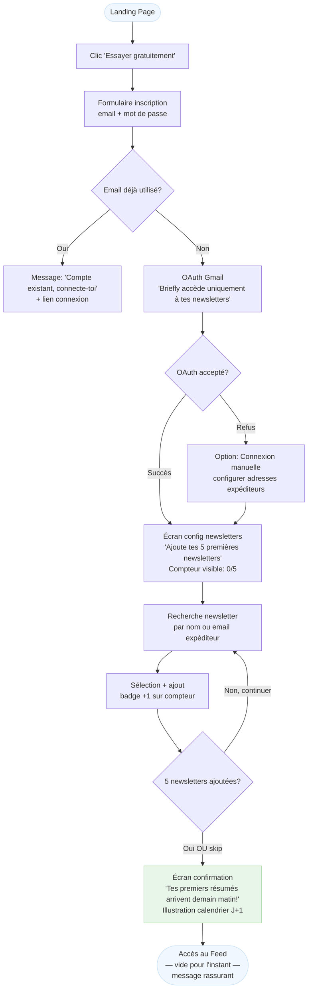
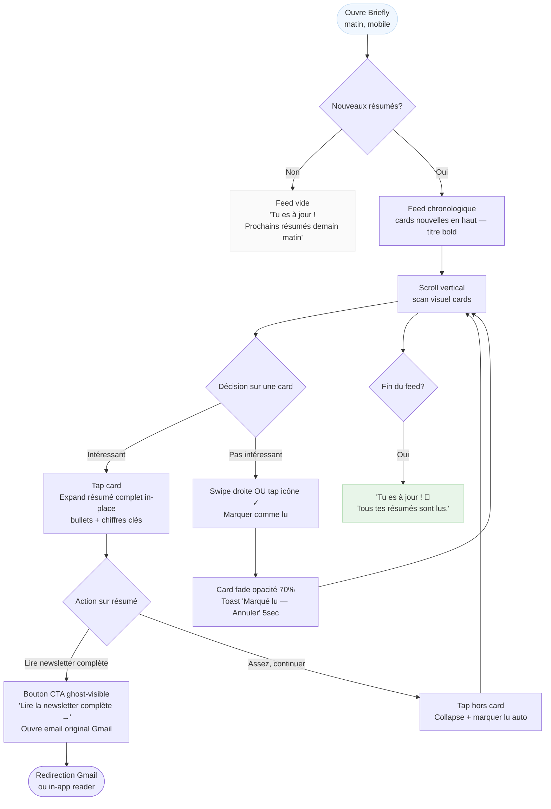
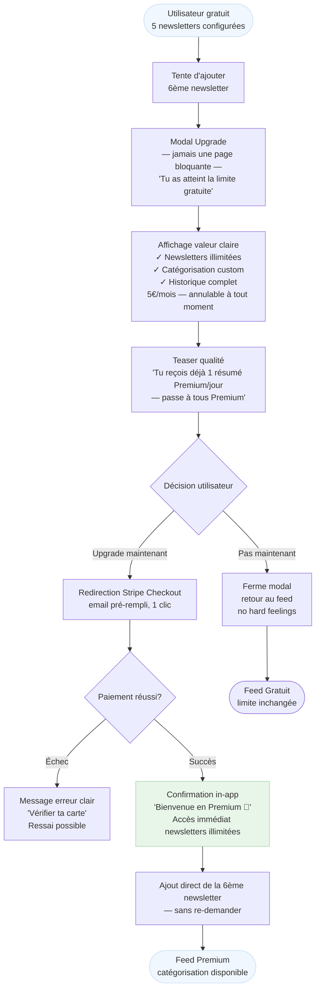
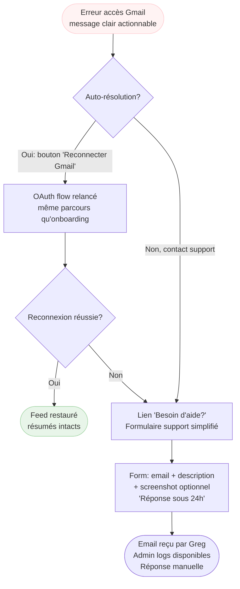

# UX Design Specification Briefly

**Author:** Greg
**Date:** 2026-02-16

---

## Executive Summary

### Project Vision

Briefly est une application web responsive qui libère les professionnels curieux de la culpabilité et du FOMO liés aux newsletters non lues. En transformant le chaos de l'inbox Gmail en résumés IA accessibles via une interface dédiée élégante, Briefly permet enfin aux utilisateurs de **tout suivre sans effort**.

La vraie valeur n'est pas seulement l'économie de temps, mais **l'exhaustivité retrouvée** - la certitude de ne rien rater d'important tout en restant informé sans stress. L'interface cards inspirée de Notion/Instagram/Pinterest transforme la corvée de lecture en moments de découverte agréables, optimisés pour les micro-moments quotidiens (mobile) et les sessions confortables (desktop/week-end).

**Différenciateurs clés:**
- UX exceptionnelle vs concurrents (Meco, LaterOn)
- Catégorisation 100% custom (expression personnelle)
- Dual-tier LLM (teaser qualité premium)
- Freemium accessible (4-5€/mois) avec validation rapide willingness-to-pay
- Mobile-first + desktop confortable (deux modes d'usage complémentaires)

### Target Users

**Profil Universel:** L'Apprenant Curieux Submergé
- Toute personne intellectuellement curieuse abonnée à 10-30+ newsletters
- Lit seulement 20-30% de ce qu'elle reçoit par manque de temps
- Accumule 100-300+ newsletters non lues avec culpabilité et FOMO
- **Pain point principal:** Peur de rater l'important + envie de suivre toutes ses newsletters

**Niveau technique:** Accessible à tous - de tech-savvy (Marc PM) à utilisateurs moins techniques tant qu'ils lisent des newsletters. L'interface doit être intuitive sans jargon.

**Personas Clés:**

1. **Marc Tech (32 ans, PM startup)** - Professionnel tech submergé
   - 20 newsletters tech/finance/AI, 800+ non lues accumulées
   - Usage: Quotidien mobile (matin café, transports), desktop soir
   - Moment "Aha!": "Je peux ENFIN tout suivre sans culpabilité"

2. **Sophie Multi-Passions (29 ans, designer freelance)** - Exploratrice curieuse
   - 15+ newsletters variées (food, design, parentalité, business)
   - Usage: Micro-moments dispersés mobile, week-end desktop
   - Besoin: Flexibilité catégorisation custom selon passions multiples

3. **Greg Admin (fondateur)** - Opérateur side project 10h/semaine
   - Monitoring coûts LLM, metrics business, support utilisateurs
   - Besoin: Dashboard admin simple, alerts coûts, troubleshooting rapide

4. **Emma Support** - Utilisatrice bloquée cherchant aide
   - Problèmes techniques occasionnels (OAuth, bugs)
   - Besoin: Résolution rapide, messages d'erreur clairs

**Contexte d'usage:**
- **Mobile (prioritaire):** Micro-moments quotidiens - matin réveil, transports, pauses, salle sport (scan rapide 2-5 min)
- **Desktop (important):** Sessions confortables - soir, week-end (lecture immersive 10-30 min)

### Key Design Challenges

**1. Réduire le FOMO dès la première utilisation**
- Challenge: Comment montrer visuellement "Tu n'as rien raté, tout est là, résumé pour toi"?
- Enjeu: Créer confiance immédiate que l'IA a bien capté l'essentiel
- Impact UX: Interface doit communiquer exhaustivité + qualité résumés dès premiers instants

**2. Onboarding accessible pour utilisateurs non-tech**
- Challenge: OAuth Gmail peut faire peur ("Accès à mes emails?!"), configuration manuelle doit être ultra-claire
- Enjeu: Éliminer jargon technique (LLM, API, tokens), guider sans friction
- Impact UX: Parcours onboarding ≤3 étapes, messages rassurants sécurité, instructions visuelles simples

**3. Équilibre mobile (scan rapide) vs desktop (immersion confortable)**
- Challenge: Deux modes d'usage très différents à optimiser simultanément
- Mobile: Scrolling fluide, cards compactes, lecture "snackable" (2-5 min)
- Desktop: Plus d'espace, layout potentiellement différent, confort lecture prolongée (10-30 min)
- Impact UX: Responsive design non générique - adaptations réelles selon contexte usage

**4. Conversion gratuit→payant sans frustration**
- Challenge: Limite 5 newsletters = mur potentiellement frustrant si mal présenté
- Enjeu: Présenter upgrade comme évidence (valeur claire) vs obstacle
- Impact UX: Paywall transparent, ROI explicite (5h/semaine économisées >> 5€/mois), teaser premium convaincant

### Design Opportunities

**1. Interface cards "Instagram-like" = familiarité immédiate**
- Opportunité: Exploiter patterns UX déjà connus et aimés (scrolling vertical, cartes visuelles)
- Bénéfice: Courbe apprentissage quasi-nulle, adoption immédiate
- Différenciation: Créer plaisir de découverte vs corvée (concurrents = feeds textuels classiques)

**2. Badge LLM "basique vs premium" = teaser qualité visible**
- Opportunité: Utilisateur gratuit voit 1 résumé premium/jour → comparaison directe qualité
- Bénéfice: Envie d'upgrade organique sans avoir à expliquer différence modèles IA
- Différenciation: Transparence sur qualité vs "boîte noire" concurrents

**3. Catégorisation custom = expression personnelle + fierté**
- Opportunité: Pas juste "organiser" mais "personnaliser son espace informationnel"
- Bénéfice: Utilisateurs créent leur propre taxonomie → sentiment ownership (power users adorent)
- Différenciation: 100% flexible vs thèmes prédéfinis rigides (Meco, LaterOn)

**4. Moment "Je peux ENFIN tout suivre" = promesse émotionnelle forte**
- Opportunité: Positionner comme solution définitive au FOMO newsletters
- Bénéfice: Valeur perçue très élevée (paix d'esprit + exhaustivité retrouvée)
- Différenciation: Focus sur exhaustivité sans effort vs simple "gain de temps"

---

## Core User Experience

### Defining Experience

L'expérience centrale de Briefly repose sur la **lecture et le scan rapide de résumés de newsletters** dans un feed optimisé pour la consommation dans des micro-moments quotidiens. Les utilisateurs ouvrent l'application 1 à 2 fois par jour (matin mobile, soir desktop optionnel) et passent **2 à 5 minutes** à scanner visuellement les résumés récents pour capturer l'essentiel de leurs newsletters sans effort.

**L'action la plus fréquente:** Scroll vertical dans le feed de résumés + tap sur cards pour ouvrir newsletter complète si pertinent.

**Le flow core:** Ouvrir app → Voir immédiatement nouveaux résumés → Scanner visuellement (2 min/résumé) → Cliquer vers newsletter originale si besoin → Marquer comme lu → Fermer app satisfait.

Cette boucle doit être **instantanée, fluide, et sans friction** pour créer une habitude quotidienne durable.

### Platform Strategy

**Répartition d'usage anticipée:**
- **60% mobile** (web responsive) - Micro-moments: matin réveil, transports, pauses, salle sport
- **40% desktop** - Sessions confortables: soir, week-end, lecture immersive

**Interaction Model:**
- **Mobile-first:** Touch-based avec scroll vertical fluide et tap comme interactions principales
- **Desktop:** Mouse/keyboard avec layout adapté pour confort lecture prolongée

**Contraintes MVP:**
- Pas d'app native iOS/Android au MVP = web responsive excellente critique
- Doit compenser l'absence d'app native par performance et UX web exceptionnelles
- PWA future possible mais pas priorité MVP

**Capacités device:**
- Mobile: Touch zones ≥44px, scrolling 60fps, responsive images
- Desktop: Plus d'espace pour layout riche, multi-colonnes potentiel
- Pas de fonctionnalités offline au MVP (connexion requise)

### Effortless Interactions

**Ce qui doit être complètement naturel et sans réflexion:**

1. **Visualisation immédiate des nouveaux résumés**
   - Dès ouverture app: feed chronologique des résumés récents visible instantanément
   - Zéro délai, zéro loading screen prolongé (performance <2s critical)

2. **Distinction claire lu/non-lu**
   - État visuel évident sur chaque card (badge, opacité, position dans feed)
   - L'utilisateur sait immédiatement ce qu'il a déjà vu vs nouveau contenu
   - Pas de mental load pour tracker ce qui reste à lire

3. **Scan rapide en 2 minutes maximum**
   - Résumés formatés pour scan visuel rapide (bullets, chiffres clés ressortent)
   - Hiérarchie visuelle claire (titre newsletter, date, essentiel, détails)
   - Pas de scrolling excessif pour capter l'info principale

4. **Interface pensée comme app dédiée**
   - **Différenciateur vs concurrents** (Meco, LaterOn = "boîte mail secondaire")
   - Design cards inspiré Instagram/Pinterest/Notion = familiarité immédiate
   - Navigation optimisée pour consommation contenu, pas gestion emails

**Automatique sans intervention utilisateur:**
- Génération quotidienne des résumés (J+1 automatique)
- Détection nouvelles newsletters dans inbox Gmail/Outlook
- Synchronisation état lu/non-lu entre devices (mobile ↔ desktop)

**Où utilisateurs galèrent aujourd'hui (pain points éliminés):**
- Gmail: Résumés enfouis dans threads emails, impossible scanner rapidement
- Concurrents: Interfaces "email-like" complexes, pas optimisées mobile, friction élevée

### Critical Success Moments

**Moment "Aha!" (J+1, Premier Matin):**

Marc ouvre Briefly à 7h30 sur iPhone pendant son café. Il voit **3 newsletters déjà résumées** en cards visuelles élégantes. En **5 minutes totales**, il a scanné les 3 résumés (2 min chacun en moyenne) et capté l'essentiel. Il sait immédiatement que Stratechery mérite lecture complète et clique. Sentiment: **"Wow, je viens de couvrir 3 newsletters en 5 min vs 45 min normalement."**

**Ce moment réussit si:**
- Résumés disponibles dès J+1 (pas de délai)
- Interface claire et scannnable sur mobile (pas de friction visuelle)
- Résumés **qualité premium** (essentiel capturé, pas de fluff)
- Action "ouvrir newsletter complète" évidente et immédiate

**Échec catastrophique - Deal Breaker:**

**Résumés de mauvaise qualité** = abandon immédiat. Si les résumés:
- Manquent les points clés (utilisateur doit ouvrir newsletter complète pour comprendre)
- Sont trop longs ou verbeux (pas de gain de temps)
- Sont génériques ou superficiels (pas de valeur vs lecture originale)
- Ne sont pas optimisés par type (tech/finance sans chiffres clés = échec)

→ La qualité IA des résumés est **non-négociable** - c'est la value proposition centrale.

**Flow Make-or-Break: Onboarding Ultra-Simple**

**Objectif:** Utilisateur actif avec premiers résumés en **moins de 2 minutes**.

**Parcours critique:**
1. OAuth Gmail/Outlook (30 secondes)
2. Configuration manuelle 3-5 newsletters (60-90 secondes)
3. Message clair: "Premiers résumés disponibles demain matin!"

**Échec si:**
- OAuth complexe ou fait peur ("Accès à mes emails?!")
- Configuration newsletters confuse (trop d'étapes, jargon technique)
- Utilisateur bloqué ou découragé avant d'atteindre valeur

**Retour quotidien = test ultime:**
- J+7: Utilisateur revient quotidiennement → succès
- J+30: Habitude ancrée, Briefly remplace Gmail pour newsletters → product-market fit

### Experience Principles

Ces principes guident toutes nos décisions UX pour Briefly:

**1. "Scannable en 2 minutes"**
- Densité informationnelle optimale sans surcharge cognitive
- Résumés formatés pour scan visuel rapide (bullets, gras, chiffres clés)
- Hiérarchie visuelle claire permet extraction info en un coup d'œil
- Jamais plus de 2 minutes pour capter l'essentiel d'un résumé

**2. "Qualité résumés avant tout"**
- La value prop repose sur résumés IA exceptionnels (LLM premium)
- Dual-tier LLM (basique/premium) visible via badges qualité
- Résumés optimisés par type newsletter (tech/finance = chiffres clés)
- Si qualité résumés échoue, tout le produit échoue

**3. "Onboarding frictionless"**
- Zéro obstacle entre inscription et premiers résumés
- Configuration simple (OAuth + ajout newsletters manuel) en <2 min
- Messages rassurants sécurité, zéro jargon technique
- Jamais dissuader l'utilisateur, toujours encourager progression

**4. "Mobile-first, desktop confortable"**
- 60% usage mobile (micro-moments) / 40% desktop (sessions confortables)
- Design responsive non-générique: adaptations réelles selon contexte
- Mobile: Scrolling fluide 60fps, cards compactes, touch-optimized ≥44px
- Desktop: Layout enrichi, confort lecture prolongée, multi-colonnes potentiel

**5. "App dédiée, pas email"**
- Différenciateur UX critique vs concurrents "boîte mail secondaire"
- Interface cards Instagram/Pinterest-like (familiarité + plaisir)
- Navigation optimisée consommation contenu, pas gestion emails
- Sentiment: "Je consulte mon app newsletters" vs "Je check encore mes emails"

---

## Desired Emotional Response

### Primary Emotional Goals

**Pendant l'utilisation active:**
- **Soulagement** - "Je n'ai plus cette culpabilité face aux newsletters non lues"
- **Efficacité** - "J'ai couvert 10 newsletters en 5 minutes au lieu de 45 minutes"

**Après avoir terminé la session:**
- **Satisfaction** - Sentiment d'accomplissement et de contrôle retrouvé
- L'utilisateur ferme l'app en ayant le sentiment d'avoir géré efficacement sa veille informationnelle

**Déclencheur de recommandation:**
- **Paix d'esprit** - "Je peux ENFIN tout suivre sans stress"
- C'est cette émotion qui transforme les utilisateurs en évangélistes
- Moment viral: "Tu DOIS essayer Briefly, j'ai retrouvé ma sérénité avec mes newsletters"

**Différenciateur émotionnel vs concurrents:**
- Meco/LaterOn = Interface "boîte mail secondaire" (frustration potentielle, complexité)
- Briefly = **Calme et confiance** (app dédiée, fiable, professionnelle)

### Emotional Journey Mapping

**1. Découverte (Pré-inscription):**

**Émotion cible:** Espoir
- "Enfin une solution qui pourrait vraiment résoudre mon problème"
- Éviter absolument: Scepticisme "encore un énième outil IA marketing"

**Design implications:**
- Landing page avec problème/solution claire (pas de hype marketing vide)
- Promesse concrète et mesurable ("5h/semaine économisées")
- Testimonials authentiques (si disponibles post-lancement)
- Ton professionnel, pas de survente

**2. Onboarding (OAuth + Configuration):**

**Émotions cibles:** Confiance + Sécurité
- "Je peux donner accès à mes emails en toute sécurité"
- "Je comprends exactement ce qui se passe"

**Design implications:**
- Messages OAuth ultra-clairs: "Briefly accède uniquement à tes newsletters, jamais tes emails personnels"
- Badges de sécurité visibles (SSL, OAuth 2.0 standard)
- Pas de jargon technique, langage rassurant
- Progression visible (étape 1/2, 2/2)
- Zero friction, zero blocage psychologique

**3. Premier Usage J+1 (Moment "Aha!"):**

**Émotions cibles:** Soulagement + Efficacité
- "Wow, mes 3 newsletters sont déjà résumées, c'est exactement ce que je voulais"
- "J'ai couvert 3 newsletters en 5 min vs 45 min normalement"

**Design implications:**
- Résumés visibles immédiatement dès ouverture (zéro délai perçu)
- Interface scannable en 2 minutes (hiérarchie visuelle claire)
- Qualité résumés évidente (bullets, chiffres clés, formatage pro)
- Pas de surprise/delight artificiel - pragmatisme et efficacité pure

**4. Problème/Erreur (OAuth bug, résumé manquant):**

**Émotion à éviter:** Frustration intense
- Utilisateur ne doit jamais se sentir bloqué ou paniqué

**Émotion cible:** Confiance dans la résolution
- "Je comprends le problème et je sais comment le résoudre"
- "Le support va m'aider rapidement"

**Design implications:**
- Messages d'erreur clairs et actionnables (jamais de jargon technique)
- Instructions de résolution étape par étape
- Contact support visible et accessible
- Tone empathique, jamais blâmer l'utilisateur

**5. Retour Quotidien (Habitude J+7, J+30):**

**Émotions cibles:** Confort + Familiarité
- "C'est devenu ma routine matinale, comme mon café"
- "Je sais exactement à quoi m'attendre, c'est rassurant"

**Design implications:**
- Interface stable, prévisible (pas de changements UI surprises)
- Flow identique chaque jour (cohérence absolue)
- Performance constante (jamais de lenteur aléatoire)
- S'intègre naturellement dans la routine quotidienne existante

### Micro-Emotions

**Micro-émotions critiques pour le succès:**

**1. Confiance (Critical)**

La confiance est non-négociable pour Briefly - elle touche trois dimensions:

**Confiance dans la qualité IA:**
- Les résumés captent vraiment l'essentiel (pas de points clés manqués)
- Dual-tier LLM visible = transparence sur qualité (badge basique vs premium)
- Résumés optimisés par type (tech/finance avec chiffres clés)

**Confiance dans la sécurité:**
- Données utilisateur protégées (OAuth standard, HTTPS)
- Accès email limité aux newsletters uniquement
- Pas de revente de données, pas de tracking abusif

**Confiance dans la fiabilité produit:**
- App fonctionne quotidiennement sans bug
- Résumés générés à temps chaque matin
- Performance stable (<2s génération, 60fps scrolling)

**Design implications:**
- Badge LLM sur chaque résumé (transparence qualité)
- Messages OAuth explicites ("accès newsletters only")
- Interface professionnelle/épurée (crédibilité visuelle)
- Résumés bien formatés (bullets, structure claire = qualité perçue)
- Uptime >99% (fiabilité technique)

**2. Calme / Paix d'esprit (Critical)**

L'anti-FOMO et anti-culpabilité sont au cœur de la value proposition.

**Sentiment cible:**
- "Je n'ai rien raté d'important, tout est là"
- "Je peux fermer l'app sereinement, je suis à jour"
- "Zéro stress, zéro culpabilité face aux newsletters"

**Design implications:**
- Distinction lu/non-lu claire mais non-anxiogène (état visuel évident)
- **Pas de compteurs agressifs** "X non lus" (éviter culpabilité)
- Feed chronologique simple (pas d'inbox zero gamifié)
- Ton/messaging rassurant ("Tout est résumé pour toi, tu n'as rien raté")
- **Pas de notifications push stressantes** au MVP (engagement organique)
- Pas de deadlines artificielles ou urgence forcée

**Micro-émotions secondaires importantes:**

**3. Accomplissement vs Frustration**
- Après 5 min de scan: sentiment d'avoir accompli quelque chose ("J'ai couvert mes 10 newsletters!")
- Vs frustration actuelle Gmail ("J'ai encore 50 non lus à traiter...")

**4. Clarté vs Confusion**
- Interface immédiatement compréhensible ("Je sais exactement où j'en suis")
- Navigation évidente (pas de hunt for features)
- Actions claires (ouvrir newsletter complète = évident)

### Design Implications

**Traduction émotions → choix UX concrets:**

**Pour créer CONFIANCE:**

1. **Transparence qualité IA**
   - Badge LLM visible sur chaque card résumé (basique vs premium)
   - Teaser quotidien (1 résumé premium/jour pour gratuit) = comparaison directe qualité
   - Résumés formatés professionnellement (bullets, chiffres clés ressortent, structure claire)

2. **Sécurité perçue**
   - Messages OAuth ultra-explicites: "Briefly accède uniquement à tes newsletters, jamais tes emails personnels ou professionnels"
   - Badges de sécurité visibles (SSL, OAuth 2.0 standard industry)
   - Privacy policy accessible et claire (GDPR compliant)

3. **Fiabilité technique**
   - Performance constante (<2s génération, 60fps scrolling)
   - Uptime >99% (infrastructure stable)
   - Messages d'erreur clairs et actionnables (jamais technique/cryptique)

4. **Professionnalisme visuel**
   - Interface épurée, pas trop ludique ou "gamifiée"
   - Design inspiré Notion/Instagram (crédibilité + familiarité)
   - Typographie lisible, hiérarchie claire

**Pour créer CALME (anti-FOMO, anti-culpabilité):**

1. **État lu/non-lu non-anxiogène**
   - Distinction visuelle claire (badge "nouveau", opacité légère, ou position feed)
   - **Mais pas de compteur rouge "12 non lus!"** (éviter culpabilité)
   - État visible sans être stressant

2. **Feed chronologique simple**
   - Pas d'inbox zero gamifié (pas de pression pour "tout finir")
   - Résumés restent accessibles indéfiniment (historique illimité)
   - Pas de notion de "overdue" ou deadlines artificielles

3. **Ton rassurant**
   - Messaging: "Tout est résumé pour toi, tu n'as rien raté"
   - Encouragement vs pression: "3 nouveaux résumés disponibles" vs "Tu as 3 newsletters à lire!"
   - Langage positif, jamais culpabilisant

4. **Zéro notifications stressantes**
   - Pas de push notifications au MVP (engagement organique)
   - Pas d'emails "Tu n'es pas revenu depuis 3 jours!"
   - Utilisateur ouvre app volontairement, à son rythme

5. **Exhaustivité rassurante**
   - Sentiment: "Briefly a tout capturé, je peux faire confiance"
   - Résumés disponibles dès J+1 automatiquement (pas de manuel catch-up)

**Émotions à ÉVITER activement:**

1. **Anxiété**
   - Pas de notifications push agressives
   - Pas de "limited time offers" ou urgence artificielle
   - Pas de gamification stressante (streaks, deadlines)

2. **Culpabilité**
   - Pas de compteurs "non lus" culpabilisants
   - Pas de messaging "Tu rates du contenu!"
   - Pas de pression pour consommer tout immédiatement

3. **Confusion**
   - Interface claire dès première utilisation
   - Zéro jargon technique (LLM, tokens, API = invisible)
   - Actions évidentes (tap pour ouvrir newsletter = immédiatement compris)

4. **Frustration**
   - Performance stable (jamais de lenteur aléatoire)
   - Résumés qualité constante (jamais de dégradation perçue)
   - Support accessible si problème (contact form visible)

### Emotional Design Principles

Ces principes guident nos choix de design pour créer les bonnes émotions:

**1. "Confiance par la transparence"**
- Montrer la qualité (badge LLM, résumés bien formatés)
- Expliquer clairement la sécurité (OAuth messaging explicite)
- Démontrer la fiabilité (performance constante, uptime élevé)

**2. "Calme par la simplicité"**
- Interface épurée sans surcharge cognitive
- Pas de compteurs anxiogènes ou deadlines artificielles
- Ton rassurant, jamais culpabilisant
- Engagement organique, pas de notifications stressantes

**3. "Pragmatisme sur surprise"**
- Efficacité pure, pas de delight artificiel au MVP
- Résultats prévisibles et cohérents (routine confortable)
- Focus sur résolution problème réel, pas entertainment

**4. "Soulagement par l'automatisation"**
- Génération résumés automatique (zéro effort utilisateur)
- Détection newsletters automatique
- Sync lu/non-lu entre devices (mental load réduit)

**5. "Satisfaction par accomplissement"**
- Sentiment clair d'avoir "tout couvert" après session
- Visibilité sur progrès (résumés scannés vs nouveaux)
- ROI évident (5 min pour 10 newsletters vs 45 min avant)

---

## UX Pattern Analysis & Inspiration

### Inspiring Products Analysis

**Apps analysées pour Briefly:**

Les utilisateurs cibles (Marc, Sophie) utilisent quotidiennement des apps avec une UX exceptionnelle. Nous nous inspirons de leurs meilleures pratiques tout en évitant leurs pièges.

#### 1. Substack - Référence Lecture Mobile (CRITIQUE)

**Ce qu'ils font exceptionnellement bien:**
- **Typographie de lecture optimale** - Police généreuse (18-20px mobile), line-height spacieux (1.6-1.8), largeur colonne limitée (600-700px max) pour confort visuel
- **Hiérarchie ultra-claire** - Titres bien différenciés, paragraphes aérés, respiration visuelle
- **Espacement généreux** - Pas de densité oppressante, chaque élément respire
- **Mode lecture immersif** - Focus total sur le contenu, distractions éliminées

**Pourquoi c'est critique pour Briefly:**
Les utilisateurs liront 10-15 résumés par session quotidienne. Typographie fatigante = échec du produit. La qualité de lecture Substack garantit scan rapide sans fatigue oculaire.

**Application concrète:**
- Résumés dans feed: 16-18px minimum, line-height 1.5-1.7
- Bullets bien espacés (margin vertical généreux)
- Si affichage newsletter in-app: adopter mode lecture Substack complet

#### 2. Instagram - Référence Feed Vertical & Cards

**Ce qu'ils font exceptionnellement bien:**
- **Scrolling vertical ultra-fluide** - 60fps constant, momentum scrolling naturel, infinite scroll sans friction
- **Cards immédiatement compréhensibles** - Information hiérarchisée (header → contenu → actions) en un coup d'œil
- **Interactions évidentes** - Gestes naturels (tap pour ouvrir, swipe pour naviguer), zéro courbe apprentissage
- **Familiarité universelle** - Pattern utilisé quotidiennement par Marc/Sophie = adoption immédiate

**Pourquoi c'est critique pour Briefly:**
Le feed est le cœur de l'expérience (60% du temps passé). Instagram a perfectionné le scrolling vertical mobile. Ne pas réinventer la roue.

**Application concrète:**
- Structure card: Header (logo newsletter + metadata) → Contenu résumé → Actions (lire complet, état lu/non-lu)
- Scrolling infini (pas de pagination = friction)
- Touch zones généreuses (≥44px boutons, card entière tappable)
- Performance 60fps non-négociable

#### 3. Notion - Référence Organisation Professionnelle

**Ce qu'ils font exceptionnellement bien:**
- **Interface épurée professionnelle** - Espace blanc généreux, zéro clutter visuel, hiérarchie claire
- **Typographie système moderne** - Inter/SF Pro, lisible, familière, professionnelle
- **Actions subtiles** - Hover states élégants, transitions douces (jamais agressif)
- **Crédibilité perçue** - Design sérieux = confiance immédiate (vs ludique = méfiance)

**Pourquoi c'est critique pour Briefly:**
Notion est la référence "outil productivité professionnel" pour Marc/Sophie. Esthétique similaire = crédibilité par association.

**Application concrète:**
- Palette couleurs sobre (noir/gris + un accent couleur max)
- Espace blanc généreux entre cards (respiration = calme émotionnel)
- Typographie système (SF Pro iOS, Roboto Android, Inter web) = performance + familiarité
- Navigation simple: Sidebar/Top nav avec "Feed / Newsletters / Catégories / Settings"

#### 4. Apple News - Référence Distinction Lu/Non-Lu

**Ce qu'ils font exceptionnellement bien:**
- **État lu/non-lu subtil** - Opacité différenciée (100% non-lu, 60-70% lu), pas de badges rouges anxiogènes
- **Card headlines parfaites** - Titre + source + timing + preview en un coup d'œil
- **Gestion visuelle claire** - L'utilisateur sait immédiatement où il en est sans compteurs stressants

**Pourquoi c'est critique pour Briefly:**
Marc/Sophie utilisent probablement Apple News. Pattern familier + aligné avec objectif émotionnel "calme" (pas de compteurs "12 non lus!" culpabilisants).

**Application concrète:**
- Card non-lue: Titre **bold**, opacité 100%, texte noir full
- Card lue: Titre normal weight, opacité 60-70%, texte gris, moins prominent
- **Jamais de badge rouge "NEW!"** ou compteur agressif
- Preview intelligente: 2-3 lignes résumé visibles dans feed

#### 5. Slack - Référence Message "All Caught Up"

**Ce qu'ils font exceptionnellement bien:**
- **État "up to date" rassurant** - Message "You're all caught up!" = satisfaction, accomplissement
- **Distinction lu/non-lu sans compteur** - Bold pour non-lu, normal pour lu (simple, efficace)
- **Ton positif** - Encouragement vs pression, sentiment de contrôle retrouvé

**Pourquoi c'est critique pour Briefly:**
Slack = outil quotidien Marc. Pattern "all caught up" crée sentiment **satisfaction** (objectif émotionnel clé). Anti-anxiété parfait.

**Application concrète:**
- Message fin de feed: "Tu es à jour! 🎉 Tous tes résumés sont lus."
- Ton positif, encourageant (jamais "Il te reste X newsletters à lire!")
- Sentiment accomplissement vs culpabilité

#### 6. Pocket / Instapaper - Référence Gestes & Mode Lecture

**Ce qu'ils font exceptionnellement bien:**
- **Geste swipe pour archiver** - Naturel, rapide, satisfaisant
- **Mode lecture ultra-lisible** - Typographie parfaite, largeur colonne optimale, customisation (taille texte, mode sombre)
- **Undo toast** - Annuler action par erreur (sécurité utilisateur)

**Pourquoi c'est pertinent pour Briefly:**
Marc utilise peut-être Pocket pour articles. Geste swipe = familier, efficient.

**Application concrète:**
- Swipe droite sur card = marquer comme lu (optionnel, à tester)
- Undo toast "Marqué comme lu [Annuler]" (5 secondes)
- Mode lecture dédié (si newsletter in-app): Bouton "Aa" pour taille texte, toggle clair/sombre

#### 7. YouTube - Référence Suggestions (Phase 2/3, FUTUR)

**Ce qu'ils font exceptionnellement bien:**
- **Thumbnails + metadata parfaits** - Titre + channel + metadata sociale en un coup d'œil
- **Algorithme suggestions pertinent** - Comprend goûts utilisateur, propose contenu ultra-ciblé
- **Présentation claire** - Liste ou grille, toujours scannable

**Pourquoi Phase 2 uniquement:**
MVP = focus qualité résumés. Suggestions = growth feature post product-market fit.

**Application future (v2/v3):**
- Format suggestion newsletters: Logo + nom + metadata sociale (subscribers) + description courte + bouton "Ajouter"
- Algorithme intelligent: "Basé sur tes lectures tech, essaie The Pragmatic Engineer" / "Les utilisateurs qui lisent Stratechery aiment aussi..."

#### 8. Pinterest - Utilisation LIMITÉE

**Ce qu'ils font bien:**
- Grille visuelle dense (masonry layout)
- Découverte par browsing visuel exploratoire

**Pourquoi limiter l'inspiration:**
Pinterest = exploration visuelle non-linéaire. Briefly = routine quotidienne séquentielle chronologique. Use cases très différents.

**Ce qu'on pourrait emprunter (optionnel, v2):**
- Système "Pin to board" → "Sauvegarder pour plus tard" (feature future)

**Ce qu'on évite:**
- ❌ Grille masonry (trop dense, pas optimal lecture séquentielle)
- ❌ Discovery browsing (pas la priorité MVP)

### Transferable UX Patterns

**Patterns à adopter pour Briefly:**

#### Navigation Patterns

**1. Feed Vertical Infini (Instagram + Apple News)**

**Pattern:** Scrolling vertical chronologique (récent → ancien) avec infinite scroll

**Transfert Briefly:**
- Feed principal = liste chronologique résumés (plus récents en premier)
- Infinite scroll (pas de pagination qui casse le flow)
- Performance 60fps obligatoire (mobile-first)
- Pull-to-refresh pour check nouveaux résumés

**Pourquoi ça fonctionne:** Pattern universel, zéro courbe apprentissage, optimal micro-moments (2-5 min sessions)

**2. Navigation Simple 4-5 Items Max (Notion + Apple News)**

**Pattern:** Sidebar ou bottom nav avec navigation primaire uniquement (4-5 items max)

**Transfert Briefly:**
- Mobile: Bottom nav avec "Feed / Newsletters / [Catégories si payant] / Settings"
- Desktop: Sidebar avec mêmes items + espace blanc généreux
- Pas de mega-menu ou navigation complexe (confusion)

**Pourquoi ça fonctionne:** Simplicité = calme émotionnel. Marc/Sophie savent toujours où ils sont.

#### Interaction Patterns

**3. Card Tappable avec Preview Expand (Apple News)**

**Pattern:** Tap sur card = expand pour voir contenu complet (ou navigation vers détail)

**Transfert Briefly:**
- Card feed montre preview résumé (2-3 lignes + bullets clés)
- Tap card = expand résumé complet in-place OU navigation page dédiée
- Bouton "Lire newsletter complète" visible dans expanded state
- Retour facile au feed (swipe back, bouton retour)

**Pourquoi ça fonctionne:** Permet scan rapide feed (voir tous titres) + deep dive si intérêt (expand)

**4. Swipe pour Actions Rapides (Pocket + Apple Mail)**

**Pattern:** Swipe horizontal sur card révèle actions contextuelles (archiver, sauvegarder, etc.)

**Transfert Briefly (optionnel à tester):**
- Swipe droite = marquer comme lu + fade out card
- Swipe gauche = sauvegarder pour plus tard (v2)
- Undo toast "Marqué comme lu [Annuler]" (5 sec)

**Pourquoi ça fonctionne:** Geste naturel mobile, efficient, satisfaisant. Marc peut "clear" résumés rapidement.

**5. État Visuel Subtil Lu/Non-Lu (Apple News + Slack)**

**Pattern:** Différenciation visuelle claire mais non-anxiogène entre contenu nouveau vs déjà vu

**Transfert Briefly:**
- Non-lu: Titre newsletter **bold**, opacité 100%, texte noir
- Lu: Titre normal weight, opacité 60-70%, texte gris
- **Pas de badge rouge "NEW!"** ou compteur "12 non lus" (anxiogène)
- Optionnel: Badge discret "nouveau" bleu pâle (non-intrusif)

**Pourquoi ça fonctionne:** Aligné objectif émotionnel "calme". Utilisateur sait où il en est sans stress.

#### Visual Patterns

**6. Typographie Lecture Optimale (Substack + Pocket)**

**Pattern:** Typographie généreuse, line-height spacieux, largeur colonne limitée pour confort visuel

**Transfert Briefly:**
- Résumés feed: 16-18px, line-height 1.5-1.7, padding généreux
- Mode lecture (si in-app): 18-20px, line-height 1.7, max-width 650px
- Bullets bien espacés (margin vertical 8-12px entre items)
- Chiffres clés en **bold** pour scan rapide

**Pourquoi ça fonctionne:** 10-15 résumés/session = fatigue oculaire si typo mauvaise. Lisibilité = rétention.

**7. Espace Blanc Généreux (Notion)**

**Pattern:** Respiration visuelle entre éléments, pas de densité oppressante

**Transfert Briefly:**
- Padding entre cards: 16-24px (respiration = calme émotionnel)
- Padding interne card: 16-20px (contenu respire)
- Marges latérales mobile: 16px minimum
- Desktop: Max-width container (1200px) centré avec marges généreuses

**Pourquoi ça fonctionne:** Espace blanc = professionnalisme + calme. Dense = anxiété.

**8. Palette Couleurs Sobre (Notion + Apple News)**

**Pattern:** Noir/gris + un accent couleur maximum, pas de rainbow UI

**Transfert Briefly:**
- Texte principal: Noir (#1a1a1a) ou gris très foncé (#2d2d2d)
- Texte secondaire: Gris moyen (#6b6b6b)
- Accent couleur: Bleu (#0066cc) pour actions primaires (liens, boutons CTA)
- Backgrounds: Blanc (#ffffff) ou gris très pâle (#f5f5f5)
- Badge LLM premium: Doré subtil (#d4af37) pour différenciation qualité

**Pourquoi ça fonctionne:** Sobre = professionnel = confiance. Trop de couleurs = ludique = moins crédible.

**9. Card Structure Hiérarchisée (Instagram + Apple News)**

**Pattern:** Header → Contenu → Actions, hiérarchie visuelle immédiate

**Transfert Briefly:**

```
┌─────────────────────────────────────┐
│ HEADER                               │
│ [Logo] **The Pragmatic Engineer**   │ ← Titre bold si non-lu
│ [Badge Premium] • Il y a 2h          │ ← Metadata + timing
├─────────────────────────────────────┤
│ CONTENU                              │
│ Meta layoffs impact on remote work   │ ← Preview 2-3 lignes
│ + IC career paths discussion...      │
│                                      │
│ • Meta: 12% reduction (3,000)        │ ← Bullets chiffres clés
│ • Remote work policy changes         │
│ • IC vs manager trade-offs           │
├─────────────────────────────────────┤
│ ACTIONS                              │
│ [Lire newsletter complète →]         │ ← CTA primaire
│ [État: Non lu / Lu]                  │ ← État visuel
└─────────────────────────────────────┘
```

**Pourquoi ça fonctionne:** Scan visuel immédiat. Marc sait en 2 secondes: quelle newsletter, quand reçue, l'essentiel, action possible.

**10. Message Rassurant Fin de Feed (Slack)**

**Pattern:** Feedback positif quand utilisateur atteint fin du contenu disponible

**Transfert Briefly:**
- Quand Marc scroll tout le feed: Message "Tu es à jour! 🎉 Tous tes résumés sont lus."
- Ton encourageant, sentiment accomplissement
- Optionnel: CTA secondaire "Explorer tes catégories" ou "Gérer tes newsletters"

**Pourquoi ça fonctionne:** Satisfaction émotionnelle (objectif clé). "All caught up" = paix d'esprit.

### Anti-Patterns to Avoid

**Patterns à éviter absolument pour Briefly:**

#### 1. Compteurs Anxiogènes (Anti-pattern Gmail, Slack ancien)

**Anti-pattern:** Badge rouge "247 non lus" ou compteur agressif générant culpabilité

**Pourquoi éviter:**
- Objectif émotionnel = **calme**, pas anxiété
- Compteur = pression pour "tout finir" = stress
- Conflictuel avec promesse "exhaustivité sans effort"

**À faire à la place:**
- Distinction lu/non-lu subtile (bold vs normal)
- Pas de nombre affiché
- Message positif "3 nouveaux résumés disponibles" vs "Tu as 3 non lus!"

#### 2. Notifications Push Agressives (Anti-pattern apps news)

**Anti-pattern:** Notifications push quotidiennes/multiples "Tu n'as pas lu tes résumés!" ou "Reviens!"

**Pourquoi éviter:**
- Objectif émotionnel = **calme**, engagement organique
- Notifications = interruptions stressantes
- Marc/Sophie ouvrent app volontairement dans micro-moments (routine naturelle)

**À faire à la place:**
- Pas de notifications push au MVP
- Engagement organique (habitude quotidienne auto-entretenue)
- Si notifications futures (v2): Opt-in uniquement, timing intelligent, ton encourageant jamais culpabilisant

#### 3. Gamification Stressante (Anti-pattern Duolingo streaks)

**Anti-pattern:** Streaks, deadlines artificielles, pression pour "maintenir la série"

**Pourquoi éviter:**
- Objectif émotionnel = **satisfaction**, pas performance anxiety
- Streaks créent pression quotidienne (manquer un jour = culpabilité)
- Briefly = outil productivité pragmatique, pas jeu

**À faire à la place:**
- Pas de streaks, leaderboards, ou gamification MVP
- Focus sur valeur intrinsèque (temps économisé, exhaustivité retrouvée)
- Satisfaction vient de l'accomplissement réel ("J'ai couvert mes 10 newsletters"), pas points artificiels

#### 4. Onboarding Multi-Étapes Complexe (Anti-pattern SaaS B2B)

**Anti-pattern:** Wizard onboarding 5-7 étapes avec questions multiples, tutoriels interactifs forcés

**Pourquoi éviter:**
- Objectif = onboarding **frictionless** <2 min
- Marc/Sophie veulent valeur immédiate (résumés J+1), pas configuration longue
- Chaque étape supplémentaire = risque abandon

**À faire à la place:**
- Onboarding minimal: OAuth (30 sec) → Config 3-5 newsletters (60 sec) → Confirmation J+1
- Pas de tutoriel forcé (interface self-evident)
- Progressive disclosure (catégories custom = découverte après upgrade payant)

#### 5. Jargon Technique Visible (Anti-pattern outils dev/IA)

**Anti-pattern:** Terminologie technique exposée ("LLM tokens", "API rate limit", "OAuth scope")

**Pourquoi éviter:**
- Objectif = accessible utilisateurs **non-tech** (Sophie designer, pas seulement Marc PM)
- Jargon = confusion, perte de confiance
- Marc/Sophie veulent résultats, pas comprendre la plomberie

**À faire à la place:**
- Badge "Premium" vs "LLM GPT-4o" (abstraction qualité)
- Message OAuth: "Briefly accède à tes newsletters uniquement" vs "OAuth scope: gmail.readonly"
- Erreurs en langage clair: "Connexion Gmail perdue, reconnecte-toi" vs "OAuth token expired"

#### 6. Interface "Boîte Mail Secondaire" (Anti-pattern Meco, LaterOn)

**Anti-pattern:** Navigation complexe type email client (folders, labels, search avancée, bulk actions)

**Pourquoi éviter:**
- Différenciateur clé Briefly = **app dédiée**, pas email
- Gmail déjà complexe/frustrant = raison d'être de Briefly
- Simplicité = calme émotionnel

**À faire à la place:**
- Navigation simple (Feed / Newsletters / Catégories / Settings)
- Actions minimales (Lire complet, Marquer lu)
- Pas de folders multiples, règles complexes, ou bulk management (keep it simple)

#### 7. Résumés Trop Longs Non-Scannables (Anti-pattern résumés IA génériques)

**Anti-pattern:** Résumés 500+ mots sous forme paragraphe dense, pas de structure visuelle

**Pourquoi éviter:**
- Objectif = **scan en 2 minutes max**
- Résumé trop long = pas de gain de temps vs lire newsletter originale
- Dense/non-structuré = fatigue cognitive

**À faire à la place:**
- Résumés structurés: Preview 2-3 lignes + 3-5 bullets max
- Chiffres clés en **bold** pour scan immédiat
- Limite tokens (800 max) pour contrôle longueur
- Optimisation par type newsletter (tech/finance = chiffres ressortent)

#### 8. Grille/Masonry Layout Dense (Anti-pattern Pinterest)

**Anti-pattern:** Grille multi-colonnes dense type Pinterest masonry

**Pourquoi éviter:**
- Briefly = lecture séquentielle chronologique (récent → ancien)
- Grille = découverte exploratoire non-linéaire (use case différent)
- Mobile = une colonne verticale optimal (scroll naturel pouce)

**À faire à la place:**
- Feed vertical une colonne (mobile + desktop)
- Desktop: Possibilité 2 colonnes si écran large (>1400px), mais pas priorité MVP
- Chronologique strict (ordre = important pour newsletters quotidiennes)

#### 9. Paywall Surprise Post-Utilisation (Anti-pattern freemium agressif)

**Anti-pattern:** Laisser utilisateur configurer 10 newsletters puis bloquer "Désolé, 5 max gratuit, upgrade maintenant!"

**Pourquoi éviter:**
- Frustration intense (anti-pattern émotionnel critique)
- Perte de confiance (sentiment piège)
- Churn immédiat utilisateurs gratuits

**À faire à la place:**
- Limite **claire dès onboarding**: "Version gratuite = 5 newsletters max. Ajoute tes 5 préférées pour commencer!"
- Compteur visible: "3/5 newsletters configurées" (transparent)
- Upgrade prompt au bon moment: Quand utilisateur essaie d'ajouter 6ème (intention claire)

#### 10. Design Trop Ludique/Casual (Anti-pattern apps gamifiées)

**Anti-pattern:** Illustrations cartoon, couleurs vives multiples, animations excessives, tone très casual

**Pourquoi éviter:**
- Objectif émotionnel = **confiance professionnelle**
- Marc/Sophie = professionnels utilisant outil productivité (pas divertissement)
- Ludique excessif = manque crédibilité (méfiance sur qualité résumés IA)

**À faire à la place:**
- Esthétique sobre professionnelle (inspiration Notion)
- Palette noir/gris + un accent (bleu)
- Animations subtiles uniquement (transitions douces, pas bouncy/playful)
- Tone friendly-professionnel (pas corporate rigide, mais pas trop casual)

### Design Inspiration Strategy

**Stratégie claire pour utiliser l'inspiration:**

#### What to Adopt (Adopter tel quel)

**1. Feed vertical infini Instagram-like**
- **Pattern:** Scrolling vertical chronologique, infinite scroll, 60fps performance
- **Raison:** Familiarité universelle Marc/Sophie, zéro courbe apprentissage, optimal micro-moments mobile
- **Implementation:** Feed principal Briefly = clone structure interaction Instagram (cards scrollables verticalement)

**2. Typographie lecture Substack**
- **Pattern:** Police généreuse (18px+), line-height spacieux (1.6-1.8), largeur colonne limitée
- **Raison:** Lecture 10-15 résumés/session = fatigue si typo mauvaise. Substack a perfectionné la lisibilité.
- **Implementation:** Appliquer specs typo Substack aux résumés Briefly (tailles, espacements, largeurs)

**3. État lu/non-lu subtil Apple News**
- **Pattern:** Bold vs normal, opacité différenciée, pas de compteur rouge
- **Raison:** Aligné objectif émotionnel "calme" (pas anxiogène), pattern familier
- **Implementation:** Titre newsletter bold si non-lu, normal + opacité 70% si lu

**4. Message "All caught up" Slack**
- **Pattern:** Feedback positif fin de contenu disponible
- **Raison:** Sentiment satisfaction/accomplissement (objectif émotionnel clé)
- **Implementation:** "Tu es à jour! 🎉 Tous tes résumés sont lus." quand fin feed

**5. Palette sobre professionnelle Notion**
- **Pattern:** Noir/gris + un accent couleur, espace blanc généreux
- **Raison:** Crédibilité professionnelle = confiance (vs ludique = méfiance)
- **Implementation:** Palette Briefly = Noir (#1a1a1a), Gris (#6b6b6b), Bleu accent (#0066cc), Blanc/Gris pâle backgrounds

#### What to Adapt (Adapter à nos besoins)

**1. Card structure Instagram → Card résumé Briefly**
- **Pattern original:** Photo + caption + metadata + likes/comments
- **Adaptation Briefly:** Logo newsletter + titre + badge LLM + preview résumé + bullets + CTA "Lire complet"
- **Raison adaptation:** Structure hiérarchique identique (header → contenu → actions) mais contenu textuel vs visuel
- **Bénéfice:** Familiarité structure + optimisation pour résumés textuels

**2. Swipe actions Pocket → Marquer lu Briefly**
- **Pattern original:** Swipe pour archiver article
- **Adaptation Briefly:** Swipe droite = marquer résumé comme lu (optionnel, à tester UX)
- **Raison adaptation:** Geste naturel mobile, mais à valider si utilisateurs Briefly veulent ce pattern (risque swipe accidentel)
- **Bénéfice si adopté:** Efficacité marquer plusieurs résumés rapidement

**3. Mode lecture Pocket → Affichage newsletter complète Briefly (si in-app)**
- **Pattern original:** Mode lecture optimisé avec customisation (taille texte, mode sombre)
- **Adaptation Briefly:** Si newsletter affichée in-app (vs redirection Gmail), appliquer mode lecture Pocket
- **Raison adaptation:** Newsletter complète = contenu long (vs résumé court). Besoin customisation lecture.
- **Bénéfice:** Confort lecture newsletter complète si utilisateur choisit in-app vs Gmail

**4. Navigation Notion → Navigation Briefly**
- **Pattern original:** Sidebar avec workspaces, pages, databases
- **Adaptation Briefly:** Sidebar/Bottom nav simplifié: Feed / Newsletters / Catégories (payant) / Settings
- **Raison adaptation:** Briefly = scope plus simple que Notion (pas de workspaces multiples). Garder esprit épuré, réduire items.
- **Bénéfice:** Professionnalisme Notion + simplicité adaptée scope Briefly

**5. Suggestions YouTube → Découverte newsletters Briefly (Phase 2/3)**
- **Pattern original:** Algorithme suggestions + thumbnails/metadata
- **Adaptation Briefly:** Suggestions newsletters basées lectures + metadata sociale (subscribers, popularité)
- **Raison adaptation:** Newsletters ≠ vidéos. Pas de thumbnail visuel, focus metadata textuelle.
- **Bénéfice futur:** Croissance utilisateurs (découvrir nouvelles newsletters pertinentes sans peur surcharge)

#### What to Avoid (Éviter)

**1. Grille masonry Pinterest**
- **Raison éviter:** Briefly = lecture séquentielle chronologique ≠ découverte exploratoire non-linéaire
- **Impact si adopté:** Confusion utilisateur, scroll inefficace, perte de contexte temporel (récent vs ancien)

**2. Gamification Duolingo (streaks, leaderboards)**
- **Raison éviter:** Objectif émotionnel Briefly = calme, satisfaction pragmatique ≠ anxiety performance
- **Impact si adopté:** Pression quotidienne stressante, culpabilité si jour manqué, focus détourné valeur réelle

**3. Onboarding wizard multi-étapes B2B SaaS**
- **Raison éviter:** Objectif = frictionless <2 min, valeur immédiate J+1
- **Impact si adopté:** Abandon onboarding, frustration, délai time-to-value

**4. Jargon technique exposé (outils dev)**
- **Raison éviter:** Accessible utilisateurs non-tech (Sophie designer), confiance par simplicité
- **Impact si adopté:** Confusion, perte crédibilité, barrier adoption utilisateurs moins techniques

**5. Compteurs "non lus" anxiogènes (Gmail, Slack ancien)**
- **Raison éviter:** Anti-calme (objectif émotionnel central), génère culpabilité
- **Impact si adopté:** Stress utilisateur, conflictuel promesse "exhaustivité sans effort"

**6. Interface "email client" complexe (Meco, LaterOn)**
- **Raison éviter:** Différenciateur Briefly = app dédiée simple ≠ boîte mail secondaire
- **Impact si adopté:** Perte différenciation concurrentielle, retour complexité frustrante Gmail

#### Implementation Priority (MVP)

**Phase 1 - MVP (3 mois développement):**

**Adopter immédiatement:**
1. ✅ Feed vertical Instagram-like (core expérience)
2. ✅ Typographie Substack (lisibilité critique)
3. ✅ État lu/non-lu Apple News (calme émotionnel)
4. ✅ Palette Notion (crédibilité)
5. ✅ Card structure adaptée Instagram → Briefly
6. ✅ Message "All caught up" Slack (satisfaction)

**Tester/Valider:**
7. ⚠️ Swipe marquer lu Pocket (optionnel, tester prototype)
8. ⚠️ Mode lecture in-app (vs toujours redirection Gmail - décision architecture)

**Phase 2 - Post-MVP (Mois 4-9):**

**Ajouter si traction validée:**
9. 🔮 Suggestions newsletters YouTube-like (growth feature)
10. 🔮 Mode lecture customisable Pocket (si in-app newsletter adopté)
11. 🔮 Navigation améliorée Notion (si complexité augmente catégories/features)

**Jamais implémenter:**
- ❌ Patterns anti-patterns listés ci-dessus

---

## Design System Foundation

### Design System Choice

**Choix retenu:** Tailwind CSS + Shadcn/ui

**Type:** Système themeable avec components headless copy-paste

Tailwind CSS fournit l'infrastructure utility-first pour styling rapide et performant, tandis que Shadcn/ui offre une collection de components React accessibles et customisables copiés directement dans le codebase (pas de dépendance npm). Cette approche donne contrôle total sur le code tout en accélérant significativement le développement.

### Rationale for Selection

**1. Alignement Contexte Projet (CRITIQUE)**

**Side project solo, 3 mois MVP, 10h/semaine:**
- Tailwind = productivité maximale (styling rapide sans quitter HTML)
- Shadcn/ui = components pré-construits (pas besoin tout coder from scratch)
- Expérience existante Greg = zéro courbe apprentissage (hit the ground running)
- Équilibre optimal vitesse + qualité professionnelle

**2. Contrôle Total & Flexibilité Design**

**Objectif esthétique:** Sobre professionnelle (inspiration Notion), palette custom (#1a1a1a, #0066cc)

- Tailwind = customisation triviale via `tailwind.config.js` (colors, spacing, typography)
- Shadcn/ui = code components dans projet (modification 100% libre vs npm package black box)
- Pas de "look prédéfini" à combattre (Material Design, Ant Design = opinions fortes)
- Facilité créer esthétique Notion-like sans friction

**3. Performance Mobile Critique**

**Requis:** 60fps scrolling, bundle size <200KB (gzipped)

- Tailwind JIT = génère uniquement CSS utilisé (tree-shaking automatique)
- Petits bundles garantis (vs MUI ~100KB+ minimum)
- Headless components Shadcn = pas de CSS runtime overhead
- Optimisé pour performance web apps modernes

**4. Accessibilité WCAG 2.1 AA Native**

**Requis non-négociable:** Conformité WCAG AA pour Briefly

- Shadcn/ui construit sur Radix UI primitives (WAI-ARIA compliant natif)
- Keyboard navigation, focus management, screen reader support = built-in
- Moins de travail manuel accessibilité vs components custom from scratch

**5. Stack Technique Cohérent**

**Stack anticipé:** Next.js (React) + TypeScript

- Tailwind = first-class support Next.js (config triviale)
- Shadcn/ui = React + TypeScript (type safety maximale)
- SSR/SSG compatible (Tailwind génère CSS statique)
- Pas de conflicts styling server vs client

**6. Maintenabilité Long-Terme**

**Contrainte:** 10h/semaine post-MVP pour maintenance

- Code components dans projet = pas de breaking changes npm surprise
- Tailwind = stable, communauté massive, documentation excellente
- Updates contrôlées (copier nouveau component Shadcn si besoin vs forced upgrade)
- Simplicité debugging (CSS utility-based = inspection facile DevTools)

### Implementation Approach

**Phase 1: Configuration Initiale (Semaine 1)**

**1. Installation Tailwind CSS**

```bash
npm install -D tailwindcss postcss autoprefixer
npx tailwindcss init -p
```

**2. Configuration Theme Custom (`tailwind.config.js`)**

Définir palette, typographie, spacing selon specs Briefly:

```javascript
module.exports = {
  theme: {
    extend: {
      colors: {
        // Palette Briefly (noir/gris/bleu)
        primary: {
          DEFAULT: '#0066cc', // Bleu accent
          dark: '#0052a3',
        },
        neutral: {
          900: '#1a1a1a', // Texte principal
          700: '#2d2d2d', // Texte secondaire
          500: '#6b6b6b', // Texte gris moyen
          100: '#f5f5f5', // Background gris pâle
        },
        premium: '#d4af37', // Badge LLM premium (doré)
      },
      fontFamily: {
        // Typographie système (Substack-inspired)
        sans: ['Inter', 'SF Pro', 'Roboto', 'system-ui', 'sans-serif'],
      },
      fontSize: {
        // Tailles optimisées lecture mobile
        'summary-mobile': '16px',
        'summary-desktop': '18px',
      },
      lineHeight: {
        'summary': '1.6', // Line-height Substack-like
      },
      spacing: {
        // Spacing généreux (Notion-like)
        'card': '20px', // Padding interne cards
        'feed': '24px', // Gap entre cards feed
      },
    },
  },
}
```

**3. Installation Shadcn/ui**

```bash
npx shadcn-ui@latest init
```

Configuration interactive:
- Style: Default
- Base color: Neutral (custom #1a1a1a)
- CSS variables: Yes (facilite theming)

**Phase 2: Components Core (Semaines 2-4)**

**Components Shadcn/ui à installer:**

**1. Card** (structure résumés feed)
```bash
npx shadcn-ui@latest add card
```

Customisation:
- Ajuster padding (`p-card` = 20px)
- Border radius subtle (8px)
- Hover state élégant (shadow légère)

**2. Button** (CTA "Lire newsletter complète")
```bash
npx shadcn-ui@latest add button
```

Variants:
- `primary`: Bleu #0066cc (actions principales)
- `ghost`: Transparent (actions secondaires)
- Touch-friendly: min-height 44px mobile

**3. Badge** (LLM basique vs premium)
```bash
npx shadcn-ui@latest add badge
```

Variants custom:
- `premium`: Doré #d4af37 + texte "Premium"
- `basic`: Gris neutre + texte "Basique"

**4. Separator** (dividers cards)
```bash
npx shadcn-ui@latest add separator
```

**5. Toast** (undo actions, feedback)
```bash
npx shadcn-ui@latest add toast
```

Pour "Marqué comme lu [Annuler]" (pattern Pocket)

**6. Dialog** (modals settings, OAuth)
```bash
npx shadcn-ui@latest add dialog
```

**7. Navigation Menu** (sidebar desktop, bottom nav mobile)
```bash
npx shadcn-ui@latest add navigation-menu
```

**Components Custom à Créer:**

**1. SummaryCard** (composition Card + Badge + Button)

Composant principal feed, structure:
- Header: Logo newsletter + titre + badge LLM + timestamp
- Content: Preview résumé + bullets
- Actions: Button "Lire complet" + état lu/non-lu

**2. FeedContainer** (layout feed avec infinite scroll)

Wrapper feed avec:
- Grid vertical (gap 24px)
- Infinite scroll logic (IntersectionObserver)
- "All caught up" message fin

**3. BottomNavigation** (mobile nav)

4-5 items max: Feed / Newsletters / Catégories / Settings

**4. TopBar** (mobile header + desktop nav)

Responsive: Hamburger mobile, full nav desktop

**Phase 3: Design Tokens & Patterns (Semaine 5)**

**1. Créer `styles/tokens.css`**

Variables CSS pour réutilisation:

```css
:root {
  /* Colors */
  --color-text-primary: #1a1a1a;
  --color-text-secondary: #6b6b6b;
  --color-accent: #0066cc;
  --color-premium: #d4af37;

  /* Typography */
  --font-summary: 16px;
  --line-height-summary: 1.6;

  /* Spacing */
  --spacing-card: 20px;
  --spacing-feed: 24px;

  /* Shadows */
  --shadow-card: 0 2px 8px rgba(0,0,0,0.08);
  --shadow-card-hover: 0 4px 16px rgba(0,0,0,0.12);
}
```

**2. Patterns Réutilisables**

**Pattern État Lu/Non-Lu (Apple News-inspired):**
```jsx
// Non-lu: bold + opacité 100%
<h3 className="font-bold text-neutral-900 opacity-100">
  Newsletter Title
</h3>

// Lu: normal + opacité 70%
<h3 className="font-normal text-neutral-500 opacity-70">
  Newsletter Title
</h3>
```

**Pattern Typographie Substack:**
```jsx
// Résumé feed mobile
<p className="text-summary-mobile leading-summary">
  Résumé content...
</p>

// Bullets espacés
<ul className="space-y-3"> {/* 12px gap */}
  <li>Bullet 1</li>
  <li>Bullet 2</li>
</ul>
```

**Pattern Cards Instagram-like:**
```jsx
<Card className="p-card hover:shadow-card-hover transition-shadow">
  {/* Header */}
  <CardHeader className="pb-4">
    <div className="flex items-center justify-between">
      <h3>Newsletter</h3>
      <Badge variant="premium">Premium</Badge>
    </div>
  </CardHeader>

  {/* Content */}
  <CardContent className="space-y-3">
    <p>Preview résumé...</p>
    <ul>Bullets...</ul>
  </CardContent>

  {/* Actions */}
  <CardFooter>
    <Button>Lire complète →</Button>
  </CardFooter>
</Card>
```

**Phase 4: Responsive Strategy (Semaine 6)**

**Breakpoints Tailwind:**

```javascript
// tailwind.config.js
screens: {
  'sm': '640px',   // Tablet
  'md': '768px',   // Desktop small
  'lg': '1024px',  // Desktop
  'xl': '1280px',  // Desktop large
}
```

**Mobile-First Approach:**

Base styles = mobile (320-767px), puis `md:` prefix pour desktop:

```jsx
<div className="p-4 md:p-8">  {/* 16px mobile, 32px desktop */}
  <h1 className="text-2xl md:text-4xl">  {/* Responsive typo */}
    Title
  </h1>
</div>
```

**Layout Adaptations:**

- Mobile: Bottom nav (4-5 items)
- Desktop: Sidebar nav (même items, plus d'espace)

- Mobile: 1 colonne feed (100% width)
- Desktop: 1 colonne centrée (max-width 800px) OU 2 colonnes si >1400px (optionnel v2)

### Customization Strategy

**1. Palette Professionnelle Sobre (Notion-inspired)**

**Implémentation `tailwind.config.js`:**

```javascript
colors: {
  // Primaire: Bleu accent (actions, links)
  primary: {
    DEFAULT: '#0066cc',
    hover: '#0052a3',
  },

  // Neutral: Noir/gris (textes, backgrounds)
  neutral: {
    900: '#1a1a1a', // Texte principal
    700: '#2d2d2d',
    500: '#6b6b6b', // Texte secondaire
    300: '#d4d4d4',
    100: '#f5f5f5', // Background subtle
    50: '#fafafa',
  },

  // Premium: Doré (badge LLM premium)
  premium: {
    DEFAULT: '#d4af37',
    light: '#e8d4a0',
  },

  // Semantic colors
  success: '#10b981', // Green (confirmations)
  error: '#ef4444',   // Red (errors, warnings)
}
```

**Usage:**
- `text-neutral-900`: Titres, texte principal
- `text-neutral-500`: Texte secondaire, metadata
- `text-primary`: Links, CTAs
- `bg-premium`: Badge LLM premium

**2. Typographie Système Optimisée Lecture**

**Implémentation:**

```javascript
fontFamily: {
  sans: [
    'Inter',           // Primary (web)
    'SF Pro Display',  // iOS fallback
    'SF Pro Text',
    'Roboto',         // Android fallback
    'system-ui',
    'sans-serif',
  ],
},

fontSize: {
  // Feed résumés
  'summary-sm': ['16px', { lineHeight: '1.6' }],  // Mobile
  'summary': ['18px', { lineHeight: '1.7' }],     // Desktop

  // Bullets
  'bullet': ['16px', { lineHeight: '1.5' }],

  // Metadata (timestamp, newsletter name)
  'meta': ['14px', { lineHeight: '1.4' }],
}
```

**Principe Substack:**
- Police généreuse (jamais <16px mobile)
- Line-height spacieux (1.6-1.7 vs 1.4 standard)
- Max-width 650-700px paragraphes (confort lecture)

**3. Spacing Généreux (Anti-Densité)**

**Implémentation:**

```javascript
spacing: {
  // Cards
  'card-padding': '20px',      // Padding interne cards
  'card-gap': '24px',          // Gap entre cards feed

  // Bullets
  'bullet-gap': '12px',        // Margin vertical entre bullets

  // Sections
  'section-gap': '32px',       // Gap entre sections (Header/Content/Actions)
}
```

**Principe Notion:**
- Espace blanc = respiration visuelle = calme émotionnel
- Jamais de densité oppressante (éviter fatigue cognitive)

**4. Components Custom Briefly-Specific**

**SummaryCard (Component Principal):**

Customisation Shadcn Card:

```jsx
// components/ui/summary-card.tsx
export function SummaryCard({
  newsletter,
  summary,
  isRead,
  isPremium
}) {
  return (
    <Card className={cn(
      "p-card-padding hover:shadow-card-hover transition-all",
      isRead && "opacity-70" // Apple News pattern
    )}>
      <CardHeader className="pb-4 space-y-2">
        {/* Newsletter title + badge */}
        <div className="flex items-center justify-between">
          <h3 className={cn(
            "text-lg",
            !isRead && "font-bold text-neutral-900", // Non-lu: bold
            isRead && "font-normal text-neutral-500"  // Lu: normal + gray
          )}>
            {newsletter.name}
          </h3>

          {isPremium ? (
            <Badge variant="premium">Premium</Badge>
          ) : (
            <Badge variant="secondary">Basique</Badge>
          )}
        </div>

        {/* Metadata */}
        <p className="text-meta text-neutral-500">
          Il y a {newsletter.timeAgo}
        </p>
      </CardHeader>

      <CardContent className="space-y-4">
        {/* Preview résumé */}
        <p className="text-summary-sm md:text-summary text-neutral-700">
          {summary.preview}
        </p>

        {/* Bullets clés */}
        <ul className="space-y-bullet">
          {summary.bullets.map((bullet, i) => (
            <li key={i} className="flex items-start gap-2">
              <span className="text-primary">•</span>
              <span className="text-bullet">{bullet}</span>
            </li>
          ))}
        </ul>
      </CardContent>

      <CardFooter className="pt-4">
        <Button variant="ghost" className="w-full">
          Lire newsletter complète →
        </Button>
      </CardFooter>
    </Card>
  );
}
```

**FeedContainer:**

```jsx
// components/feed-container.tsx
export function FeedContainer({ summaries }) {
  return (
    <div className="max-w-3xl mx-auto px-4 md:px-8">
      {/* Feed cards */}
      <div className="space-y-card-gap">
        {summaries.map(summary => (
          <SummaryCard key={summary.id} {...summary} />
        ))}
      </div>

      {/* All caught up message (Slack pattern) */}
      {summaries.length > 0 && (
        <div className="mt-8 text-center">
          <p className="text-neutral-500">
            Tu es à jour! 🎉 Tous tes résumés sont lus.
          </p>
        </div>
      )}
    </div>
  );
}
```

**5. Dark Mode Strategy (Optionnel MVP, Easy Add Later)**

Tailwind + Shadcn = dark mode trivial:

```javascript
// tailwind.config.js
darkMode: 'class', // Toggle via class="dark"
```

```jsx
// Toggle component
<button onClick={() => toggleDark()}>
  <Moon className="dark:hidden" />
  <Sun className="hidden dark:block" />
</button>
```

CSS variables adapt automatiquement:

```css
:root {
  --background: #ffffff;
  --text: #1a1a1a;
}

.dark {
  --background: #1a1a1a;
  --text: #f5f5f5;
}
```

**6. Accessibility Compliance (WCAG 2.1 AA)**

**Shadcn/ui Radix primitives = WCAG compliant natif:**

- ✅ Keyboard navigation (Tab, Enter, Escape)
- ✅ Focus management (focus traps dialogs, focus visible)
- ✅ ARIA labels (aria-label, aria-describedby)
- ✅ Screen reader support (announcements, live regions)

**Validation supplémentaire:**

- Contraste texte/background ≥4.5:1 (neutral-900 sur white = 15:1 ✅)
- Touch targets ≥44px (Button min-height configured)
- Focus indicators visibles (ring-2 ring-primary Tailwind)

**Testing:**
- Lighthouse accessibility audit (score >90)
- Manual keyboard navigation test
- Screen reader test (NVDA/VoiceOver spot check)

---

## Defining Core Experience

### Defining Experience

**L'expérience définissante de Briefly:**

**"Scanner visuellement 10 résumés de newsletters en 5 minutes et capturer l'essentiel sans effort"**

C'est l'interaction centrale qui, si réussie parfaitement, fait que tout le reste suit. Cette boucle quotidienne est ce que Marc décrit à ses amis:

1. Ouvre Briefly le matin (micro-moment café, transports)
2. Scroll feed résumés pendant 5 minutes
3. Sait exactement ce qui s'est passé dans ses 10 newsletters
4. Clique sur 1-2 qui méritent lecture complète
5. Ferme l'app satisfait avec sentiment d'accomplissement

**Différenciation vs concurrents:**

Briefly ne réinvente pas l'interaction (patterns familiers Instagram/Apple News) mais réinvente la **value proposition**: résumés IA de qualité dans une app dédiée élégante vs "boîte mail secondaire" complexe (Meco, LaterOn) ou chaos Gmail.

**Métaphore produit:**

"Instagram pour tes newsletters" - Feed scrollable visuellement élégant, cards scannables, expérience mobile-first fluide.

### User Mental Model

**Modèle mental ACTUEL (avant Briefly):**

**Solution Gmail aujourd'hui:**
1. Ouvre Gmail mobile matin
2. Scroll inbox, cherche newsletters mélangées avec emails pro/perso
3. Ouvre 1 newsletter, lit entièrement (8-10 min engagement)
4. Réalise "pas le temps pour les 9 autres"
5. Ferme Gmail frustré avec culpabilité

**Croyances actuelles:**
- Newsletter = email long nécessitant lecture complète (8-10 min minimum)
- Inbox = endroit où tout s'accumule (chaos, mélange pro/perso/newsletters)
- Lecture = engagement complet ou rien (binaire: lu entièrement ou non-lu)
- "Lire plus tard" = jamais (réalité: newsletters s'accumulent indéfiniment)
- 100+ non lus = échec personnel (culpabilité, FOMO)

**Comportements observés:**
- Batch reading rare (week-end, vacances = rattrapage marathon)
- Abandon progressif (unsubscribe par frustration)
- Scan rapide email subject = décision aveugle (ouvrir ou ignorer)
- Stratégies compensation: folders Gmail, règles filtrage (complexité ajoutée)

**NOUVEAU modèle mental (avec Briefly):**

**Transformation mentale:**
- Newsletter = **résumé scannable 2 minutes** (pas email long)
- Feed dédié = **ordre, calme, séparé du chaos email** (sanctuaire)
- Lecture = **scan rapide → décision éclairée** (creuser ou passer)
- "Tout vu" = **accomplissement quotidien** (sentiment contrôle)
- Résumés = **exhaustivité sans effort** (zéro FOMO, zéro culpabilité)

**Changement comportemental attendu:**
- Routine matinale quotidienne (comme café/douche)
- Engagement léger mais constant (5 min/jour vs 0 ou 60 min/semaine)
- Décisions éclairées (savoir quoi approfondir vs deviner depuis subject)
- Relation saine newsletters (plaisir découverte vs corvée culpabilisante)

**Points de friction potentiels (à éviter):**
- Résumés trop longs (>2 min scan) = retour au problème original
- Interface complexe = rappelle frustration Gmail
- Notifications agressives = stress ajouté (anti-calme)
- Compteurs "non lus" = culpabilité réintroduite

### Success Criteria

**Critères de succès pour l'expérience centrale "Scanner 10 résumés en 5 min":**

#### 1. Vitesse Perçue Instantanée (<2 secondes)

**Critère:** Marc ouvre app → résumés visibles immédiatement, zéro friction

**Indicateurs mesurables:**
- Time to Interactive (TTI) ≤2s (PRD NFR-P1)
- First Contentful Paint (FCP) ≤1.5s (PRD NFR-P2)
- Zéro loading spinner visible (pré-chargement intelligent)
- Scrolling fluide 60fps constant (PRD NFR-P3)

**Ressenti utilisateur:**
- "L'app répond instantanément"
- Pas de frustration attente
- Confiance dans fiabilité produit

#### 2. Scan Visuel Évident (≤2 min par résumé)

**Critère:** Hiérarchie visuelle permet extraction info essentielle en un coup d'œil

**Indicateurs mesurables:**
- Résumés structurés: Preview 2-3 lignes + 3-5 bullets max (PRD FR21-22)
- Chiffres clés en **bold** (contrast ratio ≥4.5:1, PRD NFR-A2)
- Typographie Substack: 16-18px, line-height 1.6-1.7
- Hiérarchie claire: Titre → Metadata → Preview → Bullets → Actions

**Ressenti utilisateur:**
- "Je capte l'essentiel sans effort"
- Pas de relecture nécessaire pour comprendre
- Information dense mais pas oppressante

#### 3. Sentiment "Je n'ai rien raté" (Exhaustivité)

**Critère:** Marc convaincu que toutes newsletters importantes sont couvertes

**Indicateurs mesurables:**
- 100% newsletters configurées détectées (PRD FR8-15)
- Résumés générés quotidiennement automatiquement (PRD FR23)
- Distinction lu/non-lu claire (bold vs normal + opacité, Apple News pattern)
- Message "Tu es à jour! 🎉" fin feed (Slack pattern)

**Ressenti utilisateur:**
- "Briefly a tout capturé"
- Paix d'esprit (zéro FOMO)
- Confiance dans exhaustivité système

#### 4. Action vers Newsletter Complète Triviale

**Critère:** Si Marc veut approfondir, transition fluide vers newsletter originale

**Indicateurs mesurables:**
- Bouton "Lire newsletter complète" visible dans chaque card (PRD FR24)
- Tap ouvre Gmail avec newsletter exacte (deep link ou fallback)
- Retour facile au feed Briefly (navigation standard iOS/Android)
- Performance transition <1s

**Ressenti utilisateur:**
- "Je sais comment creuser si intéressé"
- Zéro friction action secondaire
- Contrôle total sur niveau engagement

#### 5. Accomplissement Après Session

**Critère:** Marc ferme app avec sentiment satisfaction vs frustration Gmail actuelle

**Indicateurs mesurables:**
- Session moyenne 2-5 min (micro-moment optimal)
- 10-15 résumés scannés par session (PRD Success Criteria)
- 15-25% taux redirection vers newsletters complètes (PRD Success Criteria)
- Message positif "Tu es à jour!" visible

**Ressenti utilisateur:**
- "J'ai couvert mes 10 newsletters en 5 min" (vs 45 min avant)
- Sentiment contrôle retrouvé (vs chaos Gmail)
- Accomplissement réel (pas points gamification artificiels)
- Envie revenir demain (habitude positive)

**Échec si:**
- ❌ Marc doit attendre >3s pour voir résumés (frustration)
- ❌ Résumés trop longs/verbeux (pas de gain temps)
- ❌ Hiérarchie confuse (fatigue cognitive)
- ❌ Newsletters manquantes dans feed (perte confiance)
- ❌ Action "Lire complète" cachée ou confuse (friction)
- ❌ Marc ferme app frustré ou incertain (échec émotionnel)

### Novel vs. Established UX Patterns

**Analyse Pattern Innovation:**

#### Briefly Utilise des PATTERNS ÉTABLIS (Stratégie Intentionnelle)

**Décision stratégique:** Zéro innovation interaction = adoption immédiate, risque confusion minimal

**Patterns familiers adoptés:**

**1. Feed Scrolling Vertical (Instagram/Twitter/Apple News)**
- Pattern universel apps mobile
- Marc/Sophie utilisent quotidiennement → zéro courbe apprentissage
- Momentum scrolling iOS/Android natif (geste musculaire ancré)
- Infinite scroll = standard attendu

**2. Cards Tappables (Instagram/Pinterest/Notion)**
- Structure header → contenu → actions = familier
- Tap pour expand/ouvrir = comportement iOS/Android par défaut
- Hiérarchie visuelle cards = pattern reconnu immédiatement

**3. État Lu/Non-Lu Subtil (Apple News/Slack)**
- Bold pour non-lu, normal pour lu = mental model existant
- Opacité différenciée = feedback visuel attendu
- Pas de badge rouge "NEW!" = évolution pattern moderne (anti-anxiété)

**4. Bottom Navigation Mobile (Standard iOS/Android)**
- 4-5 items nav = convention platform
- Icônes + labels = clarté maximale
- Position pouce naturelle = ergonomie optimale

**5. Pull-to-Refresh (Standard Mobile)**
- Geste universel "check nouveaux contenus"
- Feedback visuel spinner = attendu
- Pas besoin explication

**Bénéfices adoption patterns établis:**

✅ **Interface self-evident** - Marc comprend sans tutoriel
✅ **Zéro éducation utilisateur** - Pas besoin onboarding interactif
✅ **Transfert compétences** - Skills Instagram/Apple News = directement applicables
✅ **Confiance immédiate** - "Je sais comment ça marche"
✅ **Risque confusion minimal** - Pas de surprise désagréable
✅ **Accessibilité cognitive** - Mental load réduit (patterns automatiques)

#### L'Innovation de Briefly N'est PAS dans l'Interaction

**Où Briefly innove:**

**1. Value Proposition (Résumés IA Qualité)**
- Dual-tier LLM (basique vs premium) = différenciateur qualité
- Résumés optimisés par type newsletter (tech/finance = chiffres clés)
- Génération automatique quotidienne (zéro effort utilisateur)

**2. Positionnement Produit (App Dédiée vs Email)**
- Interface cards élégante (Instagram-like) vs boîte mail secondaire (concurrents)
- Feed chronologique simple vs navigation email complexe
- Séparation mentale newsletters/email pro = santé cognitive

**3. Modèle Économique (Freemium Accessible)**
- 5 newsletters gratuites (validation willingness-to-pay rapide)
- 4-5€/mois premium (accessible vs 10-15€ concurrents)
- Teaser qualité (1 résumé premium/jour gratuit) = conversion élégante

**Aucun pattern novel nécessitant éducation:**

❌ **Pas de geste nouveau** (swipe patterns exotiques, pinch-to-X)
❌ **Pas de métaphore complexe** (spatial organization, 3D navigation)
❌ **Pas de workflow non-standard** (gestures multi-étapes)
❌ **Pas de terminology propriétaire** (jargon Briefly-specific)

**Implication design:**

→ Skip onboarding tutorial ("Swipe ici, tap là")
→ Interface immédiatement utilisable (intuition directe)
→ Focus effort sur qualité résumés IA (vrai différenciateur)
→ Patterns familiers = confiance + vitesse adoption

### Experience Mechanics

**Décomposition détaillée: "Scanner visuellement 10 résumés en 5 minutes"**

#### 1. INITIATION - Comment l'Expérience Commence

**Contexte utilisateur:**
- **Quand:** Micro-moment quotidien (7h30 matin café, transports, pause déjeuner)
- **Où:** Mobile iPhone/Android (60% usage), optionnel desktop soir (40%)
- **État mental:** Quelques minutes libres, envie s'informer sans stress

**Déclencheur:**
- Marc tap icône Briefly sur home screen iOS
- App ouvre avec animation splash subtile (<500ms)

**Premier écran visible (<2 secondes):**

```
┌─────────────────────────────────┐
│ [Logo] Briefly        [Settings]│ ← Top bar minimal
├─────────────────────────────────┤
│                                 │
│ ┌─────────────────────────────┐ │
│ │ **The Pragmatic Engineer**  │ │ ← Card 1 (non-lu, bold)
│ │ [Premium] • Il y a 2h       │ │
│ │ Meta layoffs impact...      │ │
│ └─────────────────────────────┘ │
│                                 │
│ ┌─────────────────────────────┐ │
│ │ Stratechery (lu, gris)      │ │ ← Card 2 (lu, normal)
│ │ [Basique] • Hier            │ │
│ │ Apple Vision Pro analysis...│ │
│ └─────────────────────────────┘ │
│                                 │
│ ┌─────────────────────────────┐ │
│ │ **TLDR Newsletter**         │ │ ← Card 3 (non-lu, bold)
│ │ [Basique] • Il y a 5h       │ │
│ │ ...                         │ │
│                                 │
│         [Pull to refresh]       │
├─────────────────────────────────┤
│ [Feed][Newsletters][⚙Settings] │ ← Bottom nav
└─────────────────────────────────┘
```

**État initial:**
- Feed chronologique (plus récents en haut)
- 3 résumés non-lus visibles immédiatement (bold, opacité 100%)
- 7 résumés lus dessous (gris, opacité 70%)
- Scrolling évidemment possible (momentum visible)

**Invitation implicite:**
- Résumés non-lus attirent l'œil (bold = contraste)
- Espace blanc généreux (respiration, calme)
- Feed scrollable = affordance naturelle iOS

#### 2. INTERACTION - Ce que l'Utilisateur Fait

**Action principale: Scroll Vertical + Scan Visuel**

**Flow détaillé minute-par-minute:**

**Minute 0-1: Scan Rapide Initial**

```
Marc scroll avec pouce droit (geste naturel)
  ↓
Cards défilent fluide 60fps (satisfaction tactile)
  ↓
Voit titres newsletters (bold = non-lu attire œil)
  ↓
Repère badges "Premium" (qualité haute)
  ↓
Compte mentalement: "3 nouveaux résumés à voir"
```

**Minute 1-2: Premier Résumé Détaillé**

```
Card 1: The Pragmatic Engineer
  ↓
Scan visuel 30-40 secondes:
  - Titre: "The Pragmatic Engineer" (reconnaît newsletter)
  - Badge "Premium" (confiance qualité)
  - Timestamp "Il y a 2h" (contexte récence)
  - Preview 2-3 lignes: "Meta announces 12% layoffs..."
  - Bullets chiffres clés:
    • Meta: 12% reduction (3,000 employees)
    • Remote work policy changes effective Q2
    • IC vs manager career paths discussion
  ↓
Décision mentale: "Intéressant, je veux lire complet"
  ↓
Tap card → Expand résumé (ou navigation page dédiée)
  ↓
Animation douce 150ms (professionnelle)
  ↓
Résumé complet visible:
  - Paragraphe contexte (2-3 phrases)
  - 5 bullets détaillés avec données
  - Bouton "Lire newsletter complète →" visible
  ↓
Lit bullets détaillés (1 min)
  ↓
Décision: "Je lis complet plus tard"
  ↓
Tap "Lire newsletter complète" → Ouvre Gmail (deep link)
  ↓
Gmail ouvre newsletter exacte (transition fluide)
  ↓
Marc met en star Gmail "à lire ce soir"
  ↓
Retour Briefly (swipe back iOS ou bouton retour)
```

**Minute 2-3: Scan Résumés 2-5 Rapide**

```
Card 2: Stratechery (déjà lu hier, gris)
  ↓
Scan 10 secondes: "Déjà vu, je passe"
  ↓
Continue scroll
  ↓
Card 3: TLDR Newsletter (non-lu, bold)
  ↓
Scan 30 secondes:
  - Preview: "AI coding tools update..."
  - Bullets: GitHub Copilot new features
  ↓
Décision: "Pas urgent, je note mentalement"
  ↓
Continue scroll (marque implicitement comme "vu")
  ↓
Cards 4-5: Scan rapide 20 secondes chacun
  - "Pas pertinent aujourd'hui"
  - Continue scroll
```

**Minute 3-5: Résumés Restants + Fin**

```
Cards 6-10: Scan ultra-rapide (10-15 sec chacun)
  ↓
Scroll continue jusqu'à fin feed
  ↓
Atteint message: "Tu es à jour! 🎉 Tous tes résumés sont lus."
  ↓
Sentiment satisfaction (Slack "all caught up" pattern)
```

**Contrôles utilisés:**

- **Scroll vertical:** Pouce droit, momentum iOS naturel
- **Tap card:** Expand/collapse ou navigation détail
- **Tap bouton "Lire complète":** Ouvre Gmail newsletter originale
- **Swipe back:** Retour feed depuis Gmail (gesture iOS standard)
- **Pull-to-refresh (optionnel):** Check nouveaux résumés manuellement

**Gestes optionnels (à tester prototype):**
- **Swipe droite card:** Marquer comme lu rapidement
- **Long press card:** Actions secondaires (sauvegarder pour plus tard v2)

#### 3. FEEDBACK - Comment le Système Répond

**Feedback visuel instantané (micro-interactions):**

**Pendant scroll:**
- **Scrolling fluide 60fps constant** (PRD NFR-P3)
  - Pas de lag, pas de stutter
  - Momentum naturel iOS/Android
  - Cards défilent smooth = confiance système

- **Espace blanc généreux entre cards** (24px gap)
  - Respiration visuelle = calme émotionnel
  - Séparation claire cards = scan facilité

**Quand tap card:**
- **Animation expand douce** (150ms ease-in-out)
  - Transition professionnelle (pas bouncy/playful)
  - Card grandit verticalement, contenu reveal progressif
  - Pas de popup brutale (jarring)

- **Résumé complet visible:**
  - Bouton "Lire complète" mis en avant (bleu #0066cc)
  - Scroll interne card si contenu long (rare, max 800 tokens)

**Quand marque comme lu (automatique ou manuel):**
- **Changement visuel subtil** (Apple News pattern):
  - Titre passe de **bold** → normal weight
  - Opacité diminue 100% → 70%
  - Texte passe noir (#1a1a1a) → gris (#6b6b6b)
  - Transition douce 200ms (pas brutal)

- **Feedback implicite:** "J'ai traité celui-ci, je peux passer au suivant"

**Quand atteint fin feed:**
- **Message rassurant** (Slack "all caught up" pattern):
  ```
  ┌─────────────────────────────┐
  │                             │
  │    Tu es à jour! 🎉         │
  │                             │
  │ Tous tes résumés sont lus.  │
  │                             │
  │ [Explorer tes catégories]   │ ← CTA optionnel (payant)
  │                             │
  └─────────────────────────────┘
  ```

- **Sentiment accomplissement:**
  - Ton positif encourageant (jamais culpabilisant)
  - Fermeture élégante session
  - Pas de pression "continue à lire!"

**Si erreur (connexion perdue, OAuth expired):**
- **Toast message clair** (jamais jargon technique):
  ```
  ┌─────────────────────────────┐
  │ ⚠️ Connexion Gmail perdue    │
  │                             │
  │ [Reconnecte-toi]            │
  └─────────────────────────────┘
  ```

- **Langage simple:**
  - "Connexion Gmail perdue" (pas "OAuth token expired")
  - "Reconnecte-toi" (pas "Re-authenticate")
  - Bouton action clair (résolution évidente)

**Feedback auditif (optionnel, désactivable):**
- **Haptic feedback iOS** (optionnel):
  - Tap card = light haptic (confirmation tactile)
  - Marquer lu = medium haptic (action complétée)
  - Fin feed = success haptic (accomplissement)

- **Pas de sons** (respecte silent mode iOS/Android)

**Performance feedback (invisible mais critique):**
- **Skeleton screens** (si >1s loading):
  - Cards grises animées (pulse subtil)
  - Jamais spinner central (anxiogène)
  - Dès données arrivent: reveal progressif cards

- **Optimistic UI:**
  - Marquer lu = change immédiat (pas wait server)
  - Sync background (rollback si échec rare)

#### 4. COMPLETION - Comment l'Expérience Se Termine

**Fin de session typique (5 minutes écoulées):**

**État final Marc:**
- ✅ Scrollé 10 résumés feed (chronologique complet)
- ✅ Scanné visuellement tous titres + previews (2 min scroll total)
- ✅ Expanded 2-3 résumés intéressants (3 min lecture détail)
- ✅ Ouvert 1 newsletter complète Gmail (starred pour lecture soir)
- ✅ Noté mentalement 2 newsletters "pas urgent" (scan suffisant)

**Signal complétion clair:**
- **Message "Tu es à jour! 🎉"** = feedback explicite accomplissement
- **Fin scroll** (bounce iOS bottom feed) = feedback physique
- **Mental:** "J'ai tout vu, je peux fermer app sereinement"

**Outcomes réussis (Success Criteria validés):**

**1. Vitesse perçue instantanée ✅**
- App ouverte <2s, résumés visibles immédiatement
- Scrolling fluide 60fps constant
- Pas de frustration attente

**2. Scan visuel évident ✅**
- 10 résumés scannés en 2 min (20 sec avg par résumé pour scan initial)
- Hiérarchie claire: Titres bold attiraient œil, bullets chiffres clés ressortaient
- Pas de relecture nécessaire pour comprendre essentiel

**3. Sentiment "je n'ai rien raté" ✅**
- Toutes 10 newsletters présentes feed (exhaustivité confirmée)
- Distinction lu/non-lu claire (3 nouveaux bold, 7 anciens gris)
- Message "Tu es à jour" = paix d'esprit (zéro FOMO)

**4. Action newsletter complète triviale ✅**
- Bouton "Lire complète" évident dans expanded card
- Transition Gmail fluide (deep link fonctionnel)
- Retour Briefly facile (swipe back iOS)

**5. Accomplissement après session ✅**
- Sentiment: "J'ai couvert mes 10 newsletters en 5 min" (vs 45 min Gmail avant)
- Contrôle retrouvé (vs chaos inbox)
- Accomplissement réel (pas points gamification)
- **Envie revenir demain** = habitude positive ancrée

**Action utilisateur finale:**
- Marc ferme app (swipe up iOS multitasking)
- Mental note: "RDV demain matin 7h30"
- Retourne à routine (prendre métro, finir café)

**Prochaine session (J+1):**
- Marc rouvre Briefly matin suivant (habitude ancrée)
- Cycle répète: 3-5 nouveaux résumés disponibles
- Flow identique = routine confortable (consistance rassurante)

**Échec complétion si:**

❌ **Session >10 min** (perte efficacité, pas mieux que Gmail)
❌ **Marc ferme app frustré** (résumés mauvais, interface confuse, bugs)
❌ **Incertitude post-session** ("Ai-je tout vu? Ai-je raté quelque chose?")
❌ **Pas envie revenir** (valeur insuffisante, expérience désagréable)
❌ **Abandon après 3-7 jours** (habitude non-ancrée = échec produit)

**Success ultime (J+30):**
- Marc utilise Briefly quotidiennement (habitude ancrée comme café)
- Briefly remplace Gmail pour newsletters (succès mental model change)
- Marc recommande à collègues (paix d'esprit = viral trigger)
- **Product-market fit confirmé**

---

## Visual Design Foundation

### Color System

**Stratégie Couleur: Professionnelle Sobre (Notion-Inspired)**

**Philosophie:**
Palette minimaliste noir/gris avec accent bleu unique. Objectif: crédibilité professionnelle, calme émotionnel, contraste optimal lisibilité. Éviter rainbow UI ou couleurs ludiques (confiance > delight).

**Palette Primaire:**

```javascript
// tailwind.config.js colors
colors: {
  // Neutral: Textes & Backgrounds
  neutral: {
    900: '#1a1a1a',  // Texte principal (contrast ratio 15:1 sur blanc)
    700: '#2d2d2d',  // Texte secondaire intense
    500: '#6b6b6b',  // Texte secondaire/metadata (contrast 4.6:1)
    300: '#d4d4d4',  // Borders, dividers
    100: '#f5f5f5',  // Background subtle cards
    50:  '#fafafa',  // Background page
  },

  // Primary: Bleu Accent (Actions, Links, CTAs)
  primary: {
    DEFAULT: '#0066cc',  // Bleu principal (contrast 4.5:1 sur blanc)
    hover:   '#0052a3',  // Hover states (plus foncé)
    light:   '#3385d6',  // Variations légères (backgrounds)
  },

  // Premium: Doré (Badge LLM Premium uniquement)
  premium: {
    DEFAULT: '#d4af37',  // Doré subtil (pas criard)
    light:   '#e8d4a0',  // Background badge premium
  },

  // Semantic: Feedback Utilisateur
  success: '#10b981',  // Green (confirmations, success states)
  warning: '#f59e0b',  // Orange (warnings, attention needed)
  error:   '#ef4444',  // Red (errors, destructive actions)
}
```

**Usage Couleurs:**

| Contexte | Couleur | Exemple |
|----------|---------|---------|
| Texte principal | `neutral-900` | Titres newsletters, contenu résumés |
| Texte secondaire | `neutral-500` | Metadata (timestamp, "Il y a 2h") |
| Actions primaires | `primary` | Boutons CTA, links "Lire complète" |
| Badge Premium | `premium` | Badge doré LLM qualité |
| Badge Basique | `neutral-300` | Badge gris LLM basique |
| Backgrounds cards | `white` ou `neutral-50` | Cards résumés feed |
| Dividers | `neutral-300` | Séparateurs sections |
| Success feedback | `success` | Toast "Marqué comme lu" |
| Error states | `error` | Messages erreur, connexion perdue |

**Accessibilité Couleurs (WCAG 2.1 AA Compliant):**

- ✅ **neutral-900 sur blanc:** 15:1 ratio (AAA grade)
- ✅ **neutral-500 sur blanc:** 4.6:1 ratio (AA grade)
- ✅ **primary sur blanc:** 4.5:1 ratio (AA minimum)
- ✅ **premium sur blanc:** 3.8:1 ratio (AA large text only, utilisé uniquement badges ≥18px)
- ✅ **Tous textes principaux:** ≥4.5:1 contrast (PRD NFR-A2)

**États Interactifs:**

```javascript
// Hover states (desktop)
hover:bg-neutral-100     // Cards hover background
hover:text-primary-hover // Links hover (bleu foncé)

// Focus states (keyboard navigation)
focus:ring-2 focus:ring-primary  // Ring bleu autour élément focus
focus:outline-none               // Remove default outline

// Active states
active:scale-[0.98]  // Subtle press feedback buttons
```

**Modes Couleur:**

**MVP: Light Mode Uniquement**
- Focus 100% light mode (60% mobile jour + 40% desktop)
- Dark mode = nice-to-have Phase 2 (Tailwind + Shadcn = trivial ajouter)

**Future Dark Mode Strategy (Post-MVP):**

```css
:root {
  --background: #ffffff;
  --text-primary: #1a1a1a;
  --text-secondary: #6b6b6b;
}

.dark {
  --background: #1a1a1a;
  --text-primary: #f5f5f5;
  --text-secondary: #a3a3a3;
}
```

### Typography System

**Stratégie Typographie: Lisibilité Substack + Performance Système**

**Philosophie:**
Police généreuse optimisée lecture longue (10-15 résumés/session). Line-height spacieux (1.6-1.7), jamais <16px mobile. Fonts système (performance + familiarité). Hiérarchie claire sans sur-styling.

**Font Stack:**

```javascript
// tailwind.config.js fontFamily
fontFamily: {
  sans: [
    'Inter',              // Primary web (Google Fonts ou self-hosted)
    'SF Pro Display',     // iOS fallback (titres)
    'SF Pro Text',        // iOS fallback (body)
    'Roboto',            // Android fallback
    '-apple-system',     // macOS system
    'BlinkMacSystemFont', // Chrome macOS
    'system-ui',         // Universal system
    'sans-serif',        // Final fallback
  ],
}
```

**Rationale:**
- **Inter:** Moderne, lisible, excellent hinting, open-source, variable font disponible
- **SF Pro:** Natif iOS (zéro téléchargement), familiarité utilisateurs Apple
- **Roboto:** Natif Android, optimisé mobile
- **System fallbacks:** Performance garantie (pas de FOUT)

**Type Scale (Substack-Inspired):**

```javascript
// tailwind.config.js fontSize
fontSize: {
  // Résumés Feed (CRITIQUE pour lisibilité)
  'summary-sm': ['16px', { lineHeight: '1.6', letterSpacing: '0' }],  // Mobile
  'summary':    ['18px', { lineHeight: '1.7', letterSpacing: '0' }],  // Desktop

  // Bullets (espacement généreux)
  'bullet':     ['16px', { lineHeight: '1.5', letterSpacing: '0' }],

  // Metadata (timestamps, sources)
  'meta':       ['14px', { lineHeight: '1.4', letterSpacing: '0' }],
  'meta-sm':    ['12px', { lineHeight: '1.3', letterSpacing: '0.01em' }],

  // Titres (hiérarchie claire)
  'h1':         ['32px', { lineHeight: '1.2', letterSpacing: '-0.02em', fontWeight: '700' }],  // Page titles
  'h2':         ['24px', { lineHeight: '1.3', letterSpacing: '-0.01em', fontWeight: '600' }],  // Section headers
  'h3':         ['20px', { lineHeight: '1.4', letterSpacing: '0', fontWeight: '600' }],        // Card headers
  'h4':         ['18px', { lineHeight: '1.4', letterSpacing: '0', fontWeight: '600' }],        // Sub-headers

  // Body text
  'body':       ['16px', { lineHeight: '1.6', letterSpacing: '0' }],  // Standard body
  'body-sm':    ['14px', { lineHeight: '1.5', letterSpacing: '0' }],  // Small body
}
```

**Usage Typographie:**

| Élément | Classe | Mobile | Desktop | Line-Height |
|---------|--------|--------|---------|-------------|
| Titre newsletter card | `text-lg font-bold` | 18px | 18px | 1.4 |
| Preview résumé | `text-summary-sm md:text-summary` | 16px | 18px | 1.6-1.7 |
| Bullets résumé | `text-bullet` | 16px | 16px | 1.5 |
| Metadata (timestamp) | `text-meta` | 14px | 14px | 1.4 |
| Badge LLM | `text-meta-sm` | 12px | 12px | 1.3 |
| Page title | `text-h1` | 32px | 32px | 1.2 |
| Section header | `text-h2` | 24px | 24px | 1.3 |

**Font Weights:**

```javascript
fontWeight: {
  normal:   400,  // Body text, texte secondaire
  medium:   500,  // Emphasis subtile (rare)
  semibold: 600,  // Headers (h2, h3, h4)
  bold:     700,  // Titres newsletters non-lus, h1
}
```

**Principe Lisibilité (Substack):**

1. **Jamais <16px mobile** (fatigue oculaire = échec)
2. **Line-height spacieux 1.6-1.7** (vs 1.4 standard serré)
3. **Max-width paragraphes 650-700px** (confort lecture, éviter lignes trop longues)
4. **Letterspacing neutral** (0 ou très subtil, jamais condensed)
5. **Contrast élevé** (noir #1a1a1a sur blanc, pas gris moyen)

**Responsive Typography:**

```jsx
// Mobile-first, puis desktop adjustments
<p className="text-summary-sm md:text-summary">
  Résumé content...
</p>

// Responsive line-height si nécessaire
<h1 className="text-2xl md:text-4xl leading-tight md:leading-snug">
  Page Title
</h1>
```

**Accessibilité Typographie:**

- ✅ Taille minimum 16px mobile (WCAG AA)
- ✅ Contrast ratio ≥4.5:1 textes (PRD NFR-A2)
- ✅ Line-height ≥1.5 body text (WCAG 1.4.12)
- ✅ No text in images (screen reader friendly)
- ✅ Resizable text 200% sans scroll horizontal (WCAG 1.4.4)

### Spacing & Layout Foundation

**Stratégie Spacing: Généreux Anti-Densité (Notion-Inspired)**

**Philosophie:**
Espace blanc = respiration visuelle = calme émotionnel (objectif clé). Jamais de densité oppressante Gmail. Spacing généreux entre cards (24px), padding cards confortable (20px). Mobile-first 16px marges minimum.

**Spacing Scale (8px Base Unit):**

```javascript
// tailwind.config.js spacing
spacing: {
  // Core spacing (8px scale)
  '1':  '4px',   // Micro spacing (rare)
  '2':  '8px',   // Tight spacing
  '3':  '12px',  // Compact spacing
  '4':  '16px',  // Standard spacing
  '5':  '20px',  // Comfortable spacing
  '6':  '24px',  // Generous spacing
  '8':  '32px',  // Large spacing
  '10': '40px',  // XL spacing
  '12': '48px',  // Section dividers

  // Custom Briefly spacing
  'card-padding': '20px',  // Padding interne cards (5 * 4px)
  'card-gap':     '24px',  // Gap vertical entre cards feed (6 * 4px)
  'bullet-gap':   '12px',  // Gap vertical entre bullets (3 * 4px)
  'section-gap':  '32px',  // Gap entre sections card (8 * 4px)
}
```

**Usage Spacing:**

| Contexte | Spacing | Valeur | Rationale |
|----------|---------|--------|-----------|
| Padding cards | `p-card-padding` (p-5) | 20px | Confort lecture, respiration |
| Gap entre cards | `space-y-card-gap` (space-y-6) | 24px | Séparation claire, anti-densité |
| Gap bullets | `space-y-bullet` (space-y-3) | 12px | Lisibilité, scan rapide |
| Marges mobile | `px-4` | 16px | Minimum ergonomie pouce |
| Marges desktop | `px-8 md:px-12` | 32-48px | Confort écran large |
| Gap header/content | `space-y-4` | 16px | Hiérarchie claire |
| Gap content/actions | `space-y-section-gap` (space-y-8) | 32px | Séparation fonctionnelle |

**Layout Grid System:**

**Mobile (320-767px):**
- **1 colonne** (100% width)
- **Marges:** 16px laterales minimum
- **Max-width:** Aucune (full viewport)
- **Cards:** 100% width - 32px (16px*2 marges)

**Desktop (768px+):**
- **1 colonne centrée** (max-width 800px pour feed)
- **Marges:** 32-48px laterales
- **Container centré:** `max-w-3xl mx-auto`
- **Cards:** 800px max (lisibilité optimale)

**Future 2-colonnes (>1400px, optionnel Phase 2):**
- Feed 2 colonnes si écran très large
- Gap entre colonnes: 32px
- Non-priorité MVP (1 colonne suffit)

```jsx
// Layout pattern Briefly
<div className="max-w-3xl mx-auto px-4 md:px-8">
  {/* Feed container */}
  <div className="space-y-card-gap">
    {/* Cards */}
  </div>
</div>
```

**Component Spacing Patterns:**

**Card Résumé:**

```jsx
<Card className="p-card-padding">
  <CardHeader className="pb-4"> {/* 16px bottom */}
    {/* Titre + badge + metadata */}
  </CardHeader>

  <CardContent className="space-y-4"> {/* 16px entre éléments */}
    <p>{/* Preview */}</p>
    <ul className="space-y-bullet"> {/* 12px entre bullets */}
      <li>Bullet 1</li>
      <li>Bullet 2</li>
    </ul>
  </CardContent>

  <CardFooter className="pt-section-gap"> {/* 32px top */}
    {/* Bouton CTA */}
  </CardFooter>
</Card>
```

**Touch Targets (Mobile CRITICAL):**

```javascript
// PRD NFR-A3: Touch zones ≥44px
minHeight: {
  'touch': '44px',  // Minimum iOS/Android
  'touch-comfortable': '48px',  // Recommandé
}

minWidth: {
  'touch': '44px',
  'touch-comfortable': '48px',
}
```

**Buttons:**
```jsx
<Button className="min-h-touch px-6 py-3"> {/* 44px+ height, 24px horizontal padding */}
  Lire newsletter complète
</Button>
```

**Layout Principles:**

**1. "Mobile-First, Desktop Confortable"**
- Base styles = mobile 320-767px
- Media queries `md:` pour adaptations desktop
- Jamais hidden content mobile (responsive, pas suppressions)

**2. "Respiration Visuelle = Calme"**
- Espace blanc généreux (24px entre cards feed)
- Padding cards comfortable (20px, pas 12px serré)
- Marges latérales ergonomiques (16px mobile minimum)

**3. "Hiérarchie par Espacement"**
- Gap petit (12px) = éléments liés (bullets dans résumé)
- Gap moyen (16-20px) = sections card (header/content)
- Gap large (24-32px) = éléments distincts (cards feed, page sections)

**4. "Touch-Optimized Mobile"**
- Buttons ≥44px height (PRD NFR-A3)
- Cards entières tappables (zone large vs petit bouton)
- Marges ergonomie pouce (16px laterales = thumb-friendly)

**Breakpoints Tailwind:**

```javascript
screens: {
  'sm':  '640px',   // Tablet portrait
  'md':  '768px',   // Desktop small / Tablet landscape
  'lg':  '1024px',  // Desktop
  'xl':  '1280px',  // Desktop large
  '2xl': '1536px',  // Desktop XL
}
```

**Usage MVP Briefly:**
- **Base (mobile):** <768px (60% traffic anticipé)
- **md:** ≥768px (40% traffic desktop/tablet)
- **lg/xl/2xl:** Optionnel (peu users anticipated, nice-to-have)

### Accessibility Considerations

**WCAG 2.1 Level AA Compliance (PRD NFR-A1-13)**

**1. Contrast Ratios (WCAG 1.4.3):**

✅ **Textes principaux ≥4.5:1:**
- neutral-900 (#1a1a1a) sur blanc = **15:1** (AAA grade)
- neutral-500 (#6b6b6b) sur blanc = **4.6:1** (AA grade)
- primary (#0066cc) sur blanc = **4.5:1** (AA minimum)

✅ **Textes larges (≥18px) ≥3:1:**
- premium (#d4af37) sur blanc = **3.8:1** (AA large text)
- Utilisé uniquement badges ≥18px

✅ **UI Components ≥3:1:**
- Borders, icons, focus indicators = neutral-300 ou primary

**2. Touch Targets (WCAG 2.5.5):**

✅ **Minimum 44x44px** (PRD NFR-A3):
- Buttons: `min-h-touch` (44px)
- Cards tappables: Toute card = large target (300x150px+)
- Bottom nav items: 48x48px (confortable)

**3. Keyboard Navigation (WCAG 2.1.1):**

✅ **Tous controls keyboard-accessible:**
- Shadcn/ui Radix = built-in keyboard support
- Tab order logique (top → bottom, left → right)
- Focus indicators visibles (ring-2 ring-primary)
- Escape key ferme modals/dialogs

**4. Focus Indicators (WCAG 2.4.7):**

✅ **Focus visible:**
```jsx
<Button className="focus:ring-2 focus:ring-primary focus:ring-offset-2">
  Action
</Button>
```

- Ring bleu 2px autour élément focus
- Offset 2px (séparation claire élément)
- Contrast ≥3:1 vs background

**5. Text Resize (WCAG 1.4.4):**

✅ **200% zoom sans scroll horizontal:**
- Tailles relatives (rem vs px)
- Max-width containers (pas fixed width)
- Overflow-x: visible (jamais hidden)
- Responsive breakpoints adaptent layout

**6. Screen Reader Support (WCAG 4.1.2):**

✅ **ARIA labels complets:**
```jsx
<button aria-label="Lire la newsletter complète The Pragmatic Engineer">
  Lire complète →
</button>

<div role="feed" aria-label="Résumés de newsletters">
  {/* Cards */}
</div>

<nav aria-label="Navigation principale">
  {/* Bottom nav */}
</nav>
```

**7. Color Independence (WCAG 1.4.1):**

✅ **Info pas uniquement couleur:**
- État lu/non-lu = bold weight + opacité (pas juste couleur)
- Badge Premium = texte "Premium" + couleur dorée
- Erreurs = icône + texte + couleur rouge

**8. Responsive Text (WCAG 1.4.12):**

✅ **Line-height ≥1.5 body:**
- Résumés: 1.6-1.7 (Substack-inspired)
- Bullets: 1.5
- Metadata: 1.4 (acceptable, petite taille)

✅ **Paragraph spacing ≥2x font-size:**
- space-y-4 (16px) entre paragraphes 16px = ratio 1:1
- Acceptable car résumés courts (pas long-form)

**9. Testing Strategy:**

**Automatisé:**
- ✅ Lighthouse accessibility audit (score >90 target)
- ✅ axe-core DevTools (0 violations critical)
- ✅ WAVE browser extension (check contrast, structure)

**Manuel:**
- ✅ Keyboard navigation test (Tab through all UI)
- ✅ Screen reader test (NVDA Windows / VoiceOver macOS spot check)
- ✅ Zoom 200% test (no horizontal scroll, layout intact)
- ✅ Color blindness simulation (Chrome DevTools)

**10. Shadcn/ui Built-In Accessibility:**

✅ **Radix UI Primitives = WCAG compliant:**
- Dialog: Focus trap, Escape key, aria-modal
- Button: Proper role, keyboard activable
- Navigation: aria-current, role="navigation"
- Toast: aria-live regions (announcements screen reader)

**Compliance Summary:**

| WCAG Criterion | Level | Status | Implementation |
|----------------|-------|--------|----------------|
| 1.4.3 Contrast (text) | AA | ✅ Pass | ≥4.5:1 all text |
| 1.4.11 Contrast (UI) | AA | ✅ Pass | ≥3:1 components |
| 2.1.1 Keyboard | A | ✅ Pass | Shadcn/ui Radix |
| 2.4.7 Focus Visible | AA | ✅ Pass | ring-2 ring-primary |
| 2.5.5 Target Size | AAA | ✅ Pass | ≥44px targets |
| 1.4.4 Resize Text | AA | ✅ Pass | 200% zoom OK |
| 1.4.12 Text Spacing | AA | ✅ Pass | Line-height ≥1.5 |
| 4.1.2 Name, Role, Value | A | ✅ Pass | ARIA labels complete |

---

## Design Direction Decision

### Design Directions Explored

Quatre directions ont été explorées via un showcase HTML interactif (`ux-design-directions.html`) :

| Direction | Style | Forces | Faiblesses |
|-----------|-------|--------|------------|
| Dir 1 — Spacious & Airy | Espacement généreux, ombre douce, typo Substack, palette Notion | Calme, lisible, professionnel | CTAs trop discrets (texte fantôme sans bordure) |
| Dir 2 — Dense & Efficient | Compact 16px, top bar foncée, boutons solides | Efficacité power users | Oppressant, anti-calme, fatigue oculaire |
| Dir 3 — Minimal & Clean | Ultra-minimal, séparateurs border-bottom, fond blanc pur | Élégance maximale | Trop austère, manque de différenciation entre cards |
| Dir 4 — Bold & Confident | Top bar bleue dominante, border-radius 16px, badge doré gradient, CTA solide bleu | Personnalité forte, mémorable | Bleu trop agressif, moins sobre, fatigant long terme |

### Chosen Direction

**Direction 5 — Refined Balance (Blend Dir 1 + Dir 4)**

Direction hybride créée sur mesure à partir des retours de Greg :
- Conserver la **fluidité et l'espace** du Dir 1 (spacieux, calme, professionnel)
- Rendre les **CTAs visibles** sans tomber dans l'agression du Dir 4
- Adoucir le bleu pour qu'il soit présent sans dominer

### Design Rationale

**Éléments retenus de la Direction 1 :**
- Espacement généreux : 24px entre les cards, 20px padding interne
- Fond de page `#fafafa`, cards blanches avec shadow douce (`0 2px 8px rgba(0,0,0,0.07)`)
- Top bar blanche épurée avec bordure très subtile
- Typographie Substack : 16px, line-height 1.65, couleur texte `#2d2d2d`
- Bottom nav neutre (pas de bordure bleue agressive)
- État lu/non-lu Apple News : titre bold noir vs normal gris à 70% d'opacité

**Éléments retenus de la Direction 4 :**
- Border-radius cards augmenté à **16px** (plus doux et moderne vs 12px)
- Badge Premium en **gradient doré discret** (`#e8d4a0 → #f4e4b4`) avec texte `#6b4e10`
- Hover cards avec **bordure bleu pâle** (`#daeaff`) — signal d'interactivité subtil

**Innovation spécifique Dir 5 — CTA "ghost visible" :**
- `background: #f0f7ff` — fond bleu très pâle (visible sans être agressif)
- `border: 1.5px solid #c8dff5` — bordure bleue douce qui délimite clairement le bouton
- `color: #0055b3` — bleu légèrement assombri et calmé (vs `#0066cc` trop saturé)
- `border-radius: 10px` — arrondi cohérent avec les cards
- Hover : `background: #daeaff`, `border-color: #aacef0` — feedback visible et plaisant

**Couleur accent adoucie :**
- Accent principal : `#0055b3` (plus calme que `#0066cc`)
- Bullet points : `#4a8fd4` (bleu désaturé, accent discret dans le contenu)

### Implementation Approach

La Direction 5 est la référence visuelle pour toute la suite du design. Les décisions d'implémentation découlent directement de ce choix :

1. **Tailwind CSS** : configurer `primary.DEFAULT: '#0055b3'` et `primary.cta-bg: '#f0f7ff'`
2. **Shadcn/ui Button** : variante `ghost-visible` avec fond pâle + border (pas de bouton solide plein)
3. **Cards** : `rounded-2xl` (16px), `shadow-sm`, `border border-transparent hover:border-blue-100`
4. **Badge Premium** : gradient CSS personnalisé (pas de Tailwind utility — gradient custom)
5. **Bottom nav** : `border-t border-gray-100` (1px, très discret)
6. **File de référence visuelle** : `_bmad-output/planning-artifacts/ux-design-directions.html` → Direction 5

**Result:** WCAG 2.1 Level AA Compliant (PRD requirement met)

---

## User Journey Flows

### Flow 1 — Onboarding (Marc & Sophie)

*Objectif : utilisateur actif avec premiers résumés en < 2 minutes*



**Décisions UX clés :**
- Message OAuth rassurant : *"Briefly accède uniquement à tes newsletters, jamais tes emails personnels"*
- Compteur `0/5` visible dès le début — transparence totale sur la limite gratuite
- Skip toujours possible — jamais bloquer l'utilisateur
- Confirmation J+1 sans jargon : calendrier visuel, pas de "processing queue"
- Connexion manuelle disponible si OAuth refusé — aucun cul-de-sac

---

### Flow 2 — Core Loop Quotidien (Feed principal)

*L'interaction la plus fréquente — doit être instantanée et sans friction*



**Décisions UX clés :**
- CTA "Lire complète" en **ghost-visible** (fond `#f0f7ff` + bordure `#c8dff5`) — visible sans agression
- État lu automatique à la fermeture de la card — réduire la friction de "gestion"
- Toast "Annuler" 5 secondes — sécurité sans interrompre le flow
- Message "Tu es à jour" — satisfaction émotionnelle, anti-FOMO, anti-culpabilité

---

### Flow 3 — Conversion Gratuit → Payant

*Moment business critique — friction minimale, valeur perçue maximale*



**Décisions UX clés :**
- **Modal contextuel, jamais une page** — l'utilisateur reste dans son contexte
- Valeur en bullets clairs — pas de paragraphe marketing
- Teaser Premium visible dès le jour 1 (1 résumé gratuit/jour) — désir d'upgrade organique
- Après paiement : ajout immédiat de la newsletter déclenchante, sans friction supplémentaire
- Paywall transparent dès l'onboarding (compteur `3/5`) — jamais de surprise frustrante

---

### Flow 4 — Erreur OAuth / Support (Emma)

*Résolution autonome d'abord, support humain en dernier recours*



**Décisions UX clés :**
- Messages d'erreur en langage humain — jamais de jargon technique
- Auto-résolution en 1 clic avant de solliciter le support
- Formulaire contact minimaliste (3 champs) — pas de ticket system complexe

---

### Journey Patterns

Patterns communs identifiés à travers tous les flows, à standardiser dans les composants :

| Pattern | Implémentation Briefly |
|---|---|
| **Progressive disclosure** | Onboarding minimal → features avancées découvertes organiquement |
| **Toast + Undo** | Toutes les actions réversibles (marquer lu, supprimer) — 5 secondes |
| **Modal contextuel** | Paywall, OAuth, erreurs — jamais de redirection page complète |
| **Confirmation positive** | Chaque étape conclue par un état rassurant ("Tu es à jour", "Résumés demain!") |
| **Skip toujours disponible** | Aucun blocage obligatoire sauf OAuth (technique) |
| **État visible en permanence** | Compteur newsletters, indicateur lu/non-lu, confirmation post-action |

### Flow Optimization Principles

1. **Zéro étape superflue** — chaque écran a une seule décision à prendre
2. **Valeur avant demande** — upgrade proposé après bénéfice prouvé (J+7, limite naturelle atteinte)
3. **Erreurs actionnables** — jamais de cul-de-sac, toujours un chemin de sortie clair
4. **État émotionnel ciblé** — chaque fin de flow se termine sur une émotion positive (satisfaction, soulagement, accomplissement)
5. **Cohérence des patterns** — mêmes interactions dans tous les flows (tap, swipe, toast, modal)

---

## Component Strategy

### Design System Components

**Stack retenu :** Tailwind CSS + Shadcn/ui (décision étape 6)

Composants Shadcn/ui utilisés directement ou avec customisation mineure via les tokens Direction 5 :

| Composant Shadcn | Usage dans Briefly | Customisation |
|---|---|---|
| `Card` | Base structurelle de `SummaryCard` | border-radius 16px, shadow Direction 5 |
| `Button` | CTAs, actions secondaires | Variante `ghost-visible` (#f0f7ff + border #c8dff5) |
| `Badge` | Base du `LLMBadge` | Deux variantes custom (premium gradient, basic neutre) |
| `Dialog` | `UpgradeModal`, OAuth, erreurs | Overlay standard, contenu custom |
| `Toast` | Undo "Marqué comme lu", confirmations | Durée 5s, position bottom |
| `Input` | Recherche newsletter (onboarding) | Focus ring bleu #0055b3 |
| `Form` | Inscription, formulaire support | Validation inline, messages humains |
| `Skeleton` | Loading states feed et cards | Même border-radius que les cards |
| `Sheet` | Panneau settings (mobile slide-in) | Depuis la droite |
| `NavigationMenu` | Base de la navigation | Adaptée en BottomNavigation mobile |
| `Separator` | Dividers dans cards | 1px, #f0f0f0 |
| `Avatar` | Logo placeholder newsletter | Initiales si pas de logo |

### Custom Components

#### 1. SummaryCard

**Purpose :** Afficher un résumé de newsletter dans le feed — l'unité fondamentale de l'expérience Briefly.

**Anatomy :**
```
┌─────────────────────────────────────────┐  border-radius: 16px
│ HEADER                                   │  shadow: 0 2px 8px rgba(0,0,0,0.07)
│ [Titre newsletter bold]  [LLMBadge]      │  border: 1.5px solid transparent
│ [timestamp gris]                         │  hover: border #daeaff, shadow élevée
├─────────────────────────────────────────┤
│ CONTENU (collapsed: preview 2-3 lignes) │
│ Preview text 16px, line-height 1.65     │
│ • Bullet 1 [chiffre clé bold]           │  (visible seulement si expanded)
│ • Bullet 2                              │
│ • Bullet 3                              │
├─────────────────────────────────────────┤
│ [Lire la newsletter complète →]          │  ghost-visible: bg #f0f7ff, border #c8dff5
└─────────────────────────────────────────┘
```

**States :** `unread` (bold, 100%) · `read` (normal, 70%) · `expanded` · `collapsed` · `hover` · `loading` (skeleton)

**Accessibility :** `role="article"`, `aria-expanded`, keyboard expand avec `Enter`

---

#### 2. FeedContainer

**Purpose :** Orchestrer le feed vertical avec infinite scroll et état "caught up".

**States :** `loading` (3 skeletons) · `populated` (cards) · `empty` (J+0, message encourageant) · `all-read` (CaughtUpMessage)

**Accessibility :** `role="feed"`, `aria-busy`, `aria-label="Feed de résumés"`

---

#### 3. LLMBadge

**Purpose :** Indiquer le tier de résumé IA — différenciateur clé et teaser upgrade organique.

**Variants :**
- `premium` : gradient `#e8d4a0 → #f4e4b4`, texte `#6b4e10`, libellé "Premium"
- `basic` : fond `#f0f0f0`, texte `#6b6b6b`, libellé "Basique"

**Specs :** 12px, font-weight 600, padding 5px 10px, border-radius 6px.

**Accessibility :** `aria-label="Résumé de qualité [Premium/Basique]"`

---

#### 4. UpgradeModal

**Purpose :** Proposer l'upgrade au moment exact de la friction — sans surprise ni dark pattern.

**Anatomy :** Titre rassurant → Feature checklist (3 items) → Teaser qualité → Prix → CTA Stripe → Lien "Pas maintenant"

**Règle UX :** "Pas maintenant" jamais caché ou visuellement dégradé.

**States :** `default` · `loading` (Stripe redirect) · `success` (auto-fermeture + toast confirmation)

---

#### 5. OnboardingCounter

**Purpose :** Afficher la progression `X/5 newsletters` pendant la configuration initiale.

**Behavior :** Incrémentation temps réel, devient vert (`#10b981`) à 5/5.

**Accessibility :** `role="progressbar"`, `aria-valuenow`, `aria-valuemax="5"`

---

#### 6. NewsletterSearchResult

**Purpose :** Item de résultat lors de la recherche newsletter (onboarding et gestion).

**Anatomy :** Avatar initiales + Nom + email expéditeur + bouton "Ajouter"

**States :** `default` · `added` (bouton "✓ Ajoutée", disabled, vert)

---

#### 7. ErrorBanner

**Purpose :** Informer d'une erreur avec solution directe et ton empathique.

**Anatomy :** Icône ⚠️ + message humain + CTA résolution + lien "Besoin d'aide?"

**Ton :** "Il semble que…" — jamais accusateur.

**Accessibility :** `role="alert"`, `aria-live="assertive"`

---

#### 8. BottomNavigation

**Purpose :** Navigation principale mobile, toujours accessible.

**Items MVP :** Feed · Newsletters · Réglages (+ Catégories pour payants)

**States :** `default` (gris `#9b9b9b`) · `active` (bleu `#0066cc`)

**Touch zones :** 44px minimum (WCAG 2.5.5)

---

#### 9. CaughtUpMessage

**Purpose :** Clôturer la session sur une émotion positive — anti-FOMO, satisfaction accomplie.

**Anatomy :** 🎉 + "Tu es à jour !" + sous-titre gris "Tous tes résumés sont lus."

---

### Component Implementation Strategy

```
Tailwind CSS tokens (Direction 5)
  primary: #0055b3 | cta-bg: #f0f7ff | cta-border: #c8dff5
  radius-card: 16px | shadow-card: 0 2px 8px rgba(0,0,0,0.07)
        ↓
Shadcn/ui primitives (Card, Button, Badge, Dialog, Toast…)
        ↓
Composants custom Briefly (SummaryCard, FeedContainer, LLMBadge…)
        ↓
Pages assemblées (Feed, Onboarding, Settings, Upgrade)
```

**Principe :** Toujours composer depuis les primitives Shadcn/ui — accessibilité Radix incluse sans effort.

### Implementation Roadmap

**Phase 1 — Core MVP (Semaines 1-3)**
1. `SummaryCard` — flow core loop (priorité absolue)
2. `FeedContainer` + `CaughtUpMessage` — feed principal
3. `LLMBadge` — différenciateur visible dès J+1
4. `BottomNavigation` — navigation mobile

**Phase 2 — Onboarding & Conversion (Semaines 4-5)**
5. `OnboardingCounter` — flow onboarding
6. `NewsletterSearchResult` — configuration newsletters
7. `UpgradeModal` — conversion gratuit→payant

**Phase 3 — Robustesse (Semaine 6)**
8. `ErrorBanner` — flow support/erreurs OAuth
9. Skeleton states sur `SummaryCard` et `FeedContainer`
10. États empty et loading complets sur toutes les pages

---

## UX Consistency Patterns

### Button Hierarchy

Briefly utilise 3 niveaux d'action uniquement — jamais plus :

| Niveau | Style | Usage |
|---|---|---|
| **Primaire** | Fond `#f0f7ff`, bordure `#c8dff5`, texte `#0055b3` (ghost-visible) | Une seule action principale par écran — "Lire complète →", "Passer à Premium" |
| **Secondaire** | Texte `#0055b3`, fond transparent, sans bordure | Actions secondaires — "Annuler", "Passer", "Pas maintenant" |
| **Destructif** | Texte `#ef4444`, fond transparent | Actions irréversibles — "Supprimer newsletter" (confirmation requise) |

**Règle absolue :** Un seul bouton primaire par écran ou par card. Jamais deux primaires en compétition.

### Feedback Patterns

| Situation | Pattern | Exemple |
|---|---|---|
| **Action réversible réussie** | Toast bas, 5 secondes, lien "Annuler" | "Marqué comme lu [Annuler]" |
| **Action irréversible réussie** | Toast bas, 3 secondes, sans annuler | "Newsletter supprimée" |
| **Succès majeur** | Message inline centré + emoji | "Tu es à jour ! 🎉", "Bienvenue en Premium 🎉" |
| **Erreur actionnable** | `ErrorBanner` inline, CTA résolution visible | "Connexion Gmail perdue → Reconnecter" |
| **Erreur fatale** | Page dédiée avec support visible | Erreur serveur, compte suspendu |
| **Info/avertissement** | Banner discret haut de feed | "Résumés en cours de génération…" |

**Ton uniforme :** Positif et empathique. Jamais de jargon technique dans les messages utilisateur.

### Form Patterns

- **Validation :** Inline, au `onBlur` — l'erreur apparaît quand l'utilisateur quitte le champ, pas à la soumission
- **Messages d'erreur :** Sous le champ, rouge `#ef4444`, 14px, langage humain ("Email invalide", jamais "Pattern mismatch")
- **États des champs :**
  - `default` : border `#d4d4d4`
  - `focus` : border `#0055b3`, ring `#f0f7ff`
  - `error` : border `#ef4444` + message rouge sous le champ
  - `success` : border `#10b981` + checkmark discret
- **Bouton submit :** Désactivé tant que champs invalides. Spinner inline pendant soumission (jamais de loader page entière)
- **Règle MVP :** Jamais plus de 3 champs visibles simultanément (progressive disclosure)

### Navigation Patterns

**Mobile (≤768px) :**
- `BottomNavigation` fixe — toujours accessible, jamais cachée au scroll
- 3-4 items max, icône + libellé court
- Item actif : bleu `#0066cc`, icône filled

**Desktop (>768px) :**
- Sidebar gauche, largeur 220px, fixe
- Mêmes items que bottom nav + espace blanc généreux
- Logo Briefly en haut de sidebar

**Back navigation :**
- Mobile : chevron `←` haut gauche + swipe back natif (iOS/Android)
- Desktop : breadcrumb discret si profondeur > 2

**Règle :** L'utilisateur sait toujours où il est. Page active toujours surlignée dans la nav.

### Modal and Overlay Patterns

- **Déclencheur :** Toujours une action volontaire — jamais de modal au chargement de page
- **Fermeture :** Via `Escape`, clic overlay, bouton ✕ visible — toujours possible
- **Taille :** Max 480px wide, centré, scroll interne si contenu long
- **Contenu :** Titre clair + 1 action primaire + 1 sortie toujours visible
- **Empilement :** Jamais de modal sur modal — une seule couche à la fois
- **Accessibilité :** Focus trap, `aria-modal="true"`, `aria-labelledby` sur le titre

### Empty States and Loading Patterns

| État | Contenu | Exemple |
|---|---|---|
| **Loading initial** | 3 skeletons animés (même forme que les cards) | Feed au chargement |
| **Empty — J+0** | Illustration + message encourageant + "Reviens demain !" | Premier jour après onboarding |
| **Empty — filtré** | Message + CTA pour changer le filtre | "Aucun résumé dans cette catégorie" |
| **All caught up** | `CaughtUpMessage` — 🎉 + message positif | Fin de feed quotidien |
| **Erreur chargement** | `ErrorBanner` + bouton "Réessayer" | Problème réseau |

**Règle :** Jamais de page blanche sans message. Chaque état vide est une opportunité de rassurer.

### Search and Filter Patterns

- **Onboarding search :** Input avec recherche live (debounce 300ms), résultats en dropdown `NewsletterSearchResult`
- **Filtrage par catégorie (payants) :** Chips horizontaux scrollables, sélection unique, "Tout" toujours accessible
- **Pas de recherche full-text MVP** — hors scope, faible valeur ajoutée initiale

### Mobile-Specific Patterns

| Pattern | Implémentation |
|---|---|
| **Swipe card** | Swipe droite = marquer lu (optionnel, tester en beta) |
| **Pull-to-refresh** | Vérifier nouveaux résumés dans le feed |
| **Touch zones** | 44px minimum sur tous les éléments interactifs |
| **Tap feedback** | `active:opacity-80` sur les cards (feedback tactile immédiat) |
| **Scroll momentum** | `-webkit-overflow-scrolling: touch` préservé |

---

## Responsive Design & Accessibility

### Responsive Strategy

**Philosophie :** Mobile-first avec adaptations réelles pour desktop — pas un simple "agrandissement" du layout mobile. 60% mobile / 40% desktop (données PRD) = deux expériences complémentaires.

**Point de bascule principal : `md` (768px)**
- En dessous : BottomNavigation + layout 1 colonne pleine largeur
- Au-dessus : Sidebar 220px + layout centré max-width 720px

**Tablette (768px–1023px) :** Layout desktop simplifié — sidebar rétractable, touch zones maintenues ≥44px. Pas de layout tablette dédié au MVP.

### Breakpoint Strategy

```javascript
// tailwind.config.js — Mobile-first
screens: {
  'sm':  '640px',   // Petits téléphones paysage
  'md':  '768px',   // Point de bascule principal (nav + layout)
  'lg':  '1024px',  // Desktop standard
  'xl':  '1280px',  // Desktop large
  '2xl': '1400px',  // Desktop XL — 2 colonnes feed (v2)
}
```

**Adaptations par breakpoint :**

| Élément | Mobile (<768px) | Desktop (≥768px) |
|---|---|---|
| **Navigation** | BottomNavigation fixe (4 items) | Sidebar gauche 220px fixe |
| **Feed layout** | 1 colonne, 100% width, padding 16px | 1 colonne centrée, max-width 720px, padding 32px |
| **SummaryCard** | Padding 16px, typo 16px | Padding 20px, typo 18px |
| **Top bar** | Logo + icône settings | Logo + search bar + avatar |
| **Onboarding** | Fullscreen, étapes empilées | Modal centré 480px |
| **UpgradeModal** | Fullscreen sheet (depuis le bas) | Dialog centré 480px |
| **2 colonnes feed** | Non | Optionnel v2 si >1400px |

### Accessibility Strategy

**Niveau cible : WCAG 2.1 AA** — standard industrie, obligation légale (RGAA France), aligné avec la valeur "confiance" de Briefly.

**Contraste des couleurs (ratio ≥4.5:1 requis) :**

| Combinaison | Ratio | Statut |
|---|---|---|
| `#1a1a1a` sur `#ffffff` | 16.1:1 | ✅ AAA |
| `#6b6b6b` sur `#ffffff` | 4.6:1 | ✅ AA |
| `#0055b3` sur `#ffffff` | 5.1:1 | ✅ AA |
| `#0055b3` sur `#f0f7ff` | 4.8:1 | ✅ AA |
| `#6b4e10` sur `#f4e4b4` | 5.2:1 | ✅ AA (badge premium) |

**Navigation clavier :**
- Ordre de tabulation logique (haut→bas, gauche→droite)
- Focus visible : `ring-2 ring-[#0055b3] ring-offset-2` sur tous les éléments interactifs
- Skip link "Aller au contenu principal" (premier élément focusable, `sr-only focus:not-sr-only`)
- `Escape` ferme tous les modals et dropdowns
- `Enter`/`Space` expandent les cards et activent les boutons

**Screen readers :**
- Semantic HTML : `<main>`, `<nav>`, `<article>` (SummaryCard), `<header>`
- Icônes décoratifs : `aria-hidden="true"`
- Images newsletters : `alt="Logo [nom newsletter]"`
- `aria-live="polite"` sur les zones de feedback dynamique (toast, compteur)
- `aria-label` sur tous les boutons icônes (settings, fermer modal, marquer lu)
- `aria-expanded` sur les cards (état collapsed/expanded)

**Tailles tactiles :** Tous les éléments interactifs ≥44×44px. Cards entières = zones tappables.

### Testing Strategy

**Responsive testing :**
- Chrome DevTools Device Mode (développement quotidien)
- Appareils réels : iPhone SE, iPhone 15 Pro, iPad, MacBook
- Navigateurs : Chrome, Safari, Firefox, Edge
- Réseau : 4G simulée (Throttling DevTools) — objectif <2s chargement initial

**Accessibility testing :**
- **Automatisé :** Axe DevTools sur chaque page — 0 erreur niveau AA tolérée
- **Lighthouse :** Score accessibilité >90 sur toutes les pages principales
- **Clavier :** Navigation complète sur Feed, Onboarding, Settings, Upgrade
- **Screen reader :** VoiceOver iOS (mobile) + VoiceOver macOS (desktop) spot check
- **Daltonisme :** Simulation Deuteranopia DevTools — palette bleu/doré validée

### Implementation Guidelines

**Responsive (Tailwind mobile-first) :**
```jsx
<div className="p-4 md:p-8">              // 16px mobile → 32px desktop
<div className="text-base md:text-lg">    // 16px → 18px
<div className="block md:hidden">         // Mobile only
<div className="hidden md:block">         // Desktop only
<nav className="fixed bottom-0 md:relative md:left-0 md:top-0 md:h-screen">
```

**Accessibilité :**
```jsx
// Skip link
<a href="#main-content" className="sr-only focus:not-sr-only focus:absolute focus:p-4">
  Aller au contenu principal
</a>

// Card accessible
<article
  role="article"
  aria-label={`Résumé ${newsletter.name}`}
  aria-expanded={isExpanded}
  tabIndex={0}
  onKeyDown={(e) => e.key === 'Enter' && toggleExpand()}
/>

// Bouton icône
<button aria-label="Marquer comme lu">
  <CheckIcon aria-hidden="true" />
</button>

// Zone live pour feedback
<div aria-live="polite" aria-atomic="true">{toastMessage}</div>
```

**Performance & accessibilité cognitive :**
- Animations désactivées si `prefers-reduced-motion: reduce` (Tailwind `motion-reduce:` prefix)
- Pas d'auto-play, pas de clignotement (WCAG 2.3.1)
- Bundle JS initial cible : <200KB gzipped
